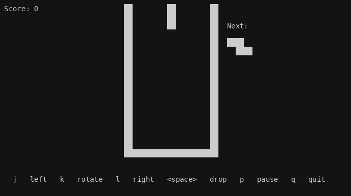

# BSD tetris(6) on the MIT board: a 9 × 17 mock port

The classic BSD `tetris(6)`, by Chris Torek and Darren F. Provine, with its well resized from 10 × 20 to **9 columns × 17 rows**. That is the layout of the 153 lit windows of MIT's Green Building. The bundle is shaped like a FreeBSD port: it fetches the same pinned distfile as `games/bsdgames`, applies one patch and builds with the base system compiler. The upstream source is **not vendored** here.



*Unattended run, level 6, with preview on (`-p`). No keys are pressed, so the pieces stack in the centre until one no longer fits. Recording: [`docs/media/casts/bsd-tetris-17x9.cast`](../../docs/media/casts/bsd-tetris-17x9.cast).*

For *why* this is not the game in this repo, and how it compares to the other FreeBSD tetris ports, see [`docs/FREEBSD-TETRIS.md`](../../docs/FREEBSD-TETRIS.md).

## Build and play (FreeBSD)

```sh
cd contrib/bsd-tetris-mit
./build.sh                          # or: make
HOME=$PWD/work/home ./work/tetris-mit -p     # or: make run
```

| File | Purpose |
|---|---|
| `fetch.sh` | downloads `pianojockl-bsdgames-v0.76_GH0.tar.gz` into `distfiles/` and checks its **sha256** `fba58361…2b748f` (2 500 755 bytes). These are the values in the FreeBSD port's `distinfo`. |
| `mit-17x9.patch` | the change, against `bsdgames-0.76/tetris/` |
| `build.sh` | extracts only `tetris/`, applies the patch and compiles with `cc … -lncurses` (the termcap API of base ncurses) into `work/tetris-mit` |
| `Makefile` | `all`, `fetch`, `run`, `clean` and `distclean`, in plain POSIX make syntax |

`work/` and `distfiles/` are git-ignored. Only base-system pieces are needed: `cc`, `patch`, `tar`, and `fetch` or `curl`. The code uses `arc4random_uniform`, `strtonum`, `ppoll` and `timespecsub` from FreeBSD libc, so it does not build on Linux without libbsd. That is not supported here.

**Checked on** FreeBSD 15.1-RELEASE (amd64) with FreeBSD clang 19.1.7, on 2026-09-11. It builds with `-Wall` and no warnings, and links only `libncursesw`, `libtinfow` and `libc`. It then ran unattended in an 80 × 22 pty until game over.

If GitHub ever regenerates its archive tarballs, `fetch.sh` fails loudly rather than building unverified source. The FreeBSD port would break in the same way.

## What the patch changes

| File | Change | Why |
|---|---|---|
| `tetris.h` | `B_COLS` 12 → **11**, `B_ROWS` 23 → **20**, `D_LAST` 22 → **19**, `A_LAST` 21 → **18**, `MINROWS` 23 → **20**. The board comment is updated to match. | The well is 9 × 17 plus a wall column on each side, two floor rows and a boundary row 0. |
| `tetris.c` | spawn column `(B_COLS/2)-1` → `(B_COLS-1)/2` | This centres pieces in an odd-width well: column 5 of 1..9. For the original 12 it gives the same value, 5. |
| `screen.c` | The **preview window** moves to the right of the well, positioned from `CTOD(B_COLS)`, and its label shortens to `Next:` | Upstream draws the preview at fixed screen columns 0–11, on the left. That was safe only because the 10-wide well sat further right. The new position fits a 40-column minimum screen. |
| `screen.c` | adds `#include <termios.h>` | Taken from the FreeBSD port's `files/patch-tetris_screen.c`. |
| `scores.c`, `tetris.6` | the score file becomes `~/.tetris-17x9.scores` | Scores on a 9 × 17 well are not comparable with 10 × 20 scores. |
| `tetris.6` | one sentence about the 9 × 17 well | |

**Unchanged:** rotation, the random generator, gravity, scoring, the keys and every option. The board size really is a compile-time constant. `board[]` is a flat array of `B_ROWS * B_COLS` cells, and every shape offset is written in terms of `B_COLS`. So the resize amounts to five `#define`s plus the two layout fixes.

A coincidence worth noting: the padded 20 × 11 board this produces has the same shape as this repo's engine board ([SPEC §3.1](../../SPEC.md)). It has walls in columns 0 and 10, floor rows 18–19 and one row above the playfield. The one difference is that BSD's row 0 is an empty boundary row, while SPEC's row 0 is a white border.

## Licence and credits

`tetris(6)` is under the 3-clause BSD licence:

> Copyright (c) 1992, 1993 The Regents of the University of California. All rights reserved. This code is derived from software contributed to Berkeley by **Chris Torek and Darren F. Provine**.

It is adapted from their 1989 International Obfuscated C Code Contest winner. The manual was written by Nancy L. Tinkham and Darren F. Provine, and the shape-preview code was adapted from code by Hubert Feyrer. This version comes through OpenBSD and DragonFly BSD as packaged by [pianojockl/bsdgames](https://github.com/pianojockl/bsdgames), which is the FreeBSD port `games/bsdgames`, maintained by jockl@pianojockl.org. `mit-17x9.patch` is offered under the same 3-clause BSD licence. The full licence text is at the top of every source file that `fetch.sh` downloads.

"Tetris" is a trademark of The Tetris Company. This is a personal educational project, not affiliated with or endorsed by them.
