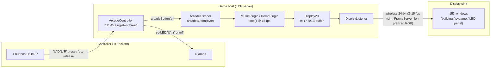
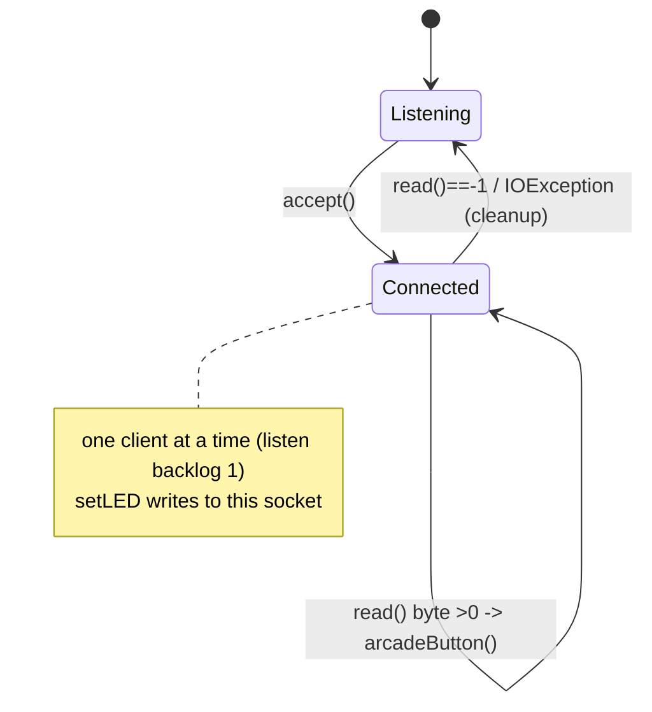

# d54-sim — arcade-protocol simulator for the Green Building display

A standalone simulator of the **original** MIT Green Building "Display 54" hack:
the 9×17 facade **and** the arcade-controller wire protocol from
`edu.mit.d54.ArcadeController` (upstream [`mitrisdev/d54`](https://github.com/mitrisdev/d54),
BSD 3-Clause). It exists so a hardware team can build and test a breadboard
controller (or a real LED panel) **without the building and without the Java
stack** — just a TCP socket and a handful of bytes.

This is the **original TCP-arcade lineage**. The modern `wal.sh/tools/display`
WebSocket lineage (`pal16`/`hex` frames, leases) lives in
[`../displays/`](../displays/); WebSocket testing is in
[`../../docs/DISPLAY-TESTING.md`](../../docs/DISPLAY-TESTING.md). They are
different protocols — see *Two protocols* below.

## The protocol, from the source

`ArcadeController.java` is a **TCP server** the game runs on **port 12345**. The
controller is the **client**. One ASCII byte per event, both directions:

| Direction | Byte | Meaning |
|---|---|---|
| controller → game | `U` `D` `L` `R` | button **press** (up/down/left/right) |
| controller → game | `u` `d` `l` `r` | button **release** (sent by `ArcadeControllerTestClient`) |
| game → controller | `U` `D` `L` `R` | lamp **on** |
| game → controller | `u` `d` `l` `r` | lamp **off** |

- **U = rotate, D = hard drop, L/R = move** in MITris. `MITrisPlugin` only acts on
  the four *uppercase* (press) bytes; releases are received but ignored by the game.
- The controller needs to know **nothing** about the 153-pixel display. It opens
  a socket, writes ≤ 8 possible bytes, reads ≤ 8 possible bytes. That is the whole
  contract.

### Faithful quirks (verified against the Java)

- **`setLEDs()` is buggy.** It uses `leds%8 / %4 / %2 / %1` where it meant
  `&8 / &4 / &2 / &1`. `leds % 1` is always `0`, so **the R lamp can never light**,
  and `%8/%4` aren't real bit tests either. This sim's `set_leds()` uses the
  intended bitmask (bit3=U, bit2=D, bit1=L, bit0=R) — verified: `set_leds(8|2)`
  emits `UdLr`.
- **A `setLED()` write can block.** `getUserInput()` holds `synchronized(this)`
  across *both* `accept()` and `in.read()`, with the socket timeout commented
  out, and `setLED()` is also `synchronized`. So on the real code a lamp update
  waits on the monitor until a client connects and sends a byte. This sim gives
  the socket its own lock so the writer never waits on the reader.

## Diagram — how it fits together



```mermaid
sequenceDiagram
    participant C as Controller (client)
    participant G as ArcadeController (:12345 server)
    participant P as Plugin (ArcadeListener)
    C->>G: TCP connect
    Note over G: accept(); "Client connected"
    C->>G: 'U'  (press rotate)
    G->>P: arcadeButton('U')
    P-->>G: set_leds(mask)
    G-->>C: 'U''d''L''r'  (lamp states)
    C->>G: 'u'  (release; game ignores)
    C--xG: close  ->  socket cleanup, back to accept()
```



## Run it

pygame is **optional** and imported lazily; only the renderer needs it. The TCP
protocol works headless without it.

```sh
pip install pygame            # optional, only for the facade window
python3 d54_sim.py            # facade + demo plugin; arrow keys play locally
python3 d54_sim.py --frames 12346   # render RGB frames pushed in on :12346
```

- `:12345` — arcade protocol (this sim is the game/server; your controller connects).
- `--frames PORT` — a `FrameServer` that renders frames from an external source
  (e.g. a Java `DisplayListener`). **Wire: `uint32` big-endian length, then that
  many bytes of row-major RGB** (459 for 9×17). *(Note: the module docstring's
  "153×3 raw RGB bytes per frame" omits the 4-byte length prefix the code
  actually requires; send the prefix.)*

Headless protocol smoke test (no pygame, no display):

```python
import socket, time, d54_sim as m      # run from this directory; import is pygame-free
ctl = m.ArcadeController(listener=print, port=12345); ctl.start(); time.sleep(0.2)
c = socket.create_connection(("127.0.0.1", 12345)); c.sendall(b'U')   # -> prints 'U'
```

## Breadboards that can drive this

Because the controller side is "open a socket, send `U/D/L/R`, read lamp bytes",
almost any Wi-Fi microcontroller works. Bind the game to your laptop's LAN IP (the
sim listens on `0.0.0.0:12345`) and point the board at it.

### A. Controller (4 buttons + 4 lamps) — Pico W / ESP32

The minimal hack-day rig: 4 tactile buttons to GND on input pins (internal
pull-ups), 4 LEDs (+ ~330Ω) on output pins, one TCP socket. MicroPython:

```python
import network, socket, machine, time
BTN = {'U':16, 'D':17, 'L':18, 'R':19}      # button GPIOs -> pull-up, active low
LED = {'U':2, 'D':3, 'L':4, 'R':5}          # lamp GPIOs
btn = {k: machine.Pin(p, machine.Pin.IN, machine.Pin.PULL_UP) for k,p in BTN.items()}
led = {k: machine.Pin(p, machine.Pin.OUT) for k,p in LED.items()}

wlan = network.WLAN(network.STA_IF); wlan.active(True)
wlan.connect("SSID","PASS")
while not wlan.isconnected(): time.sleep(0.2)

s = socket.socket(); s.connect(("192.168.86.100", 12345)); s.setblocking(False)
state = {k: 1 for k in BTN}                 # 1 = released (pull-up)
while True:
    for k,p in btn.items():                 # edge-detect, send press/release
        v = p.value()
        if v != state[k]:
            s.send((k if v == 0 else k.lower()).encode())   # 'U' press / 'u' release
            state[k] = v
    try:                                     # lamp feedback: 'U'..'r'
        for ch in s.recv(16).decode():
            if ch.upper() in led: led[ch.upper()].value(1 if ch.isupper() else 0)
    except OSError:
        pass
    time.sleep(0.01)
```

- **Pico W / Pico 2 W** (RP2040/RP2350 + CYW43): cheapest, MicroPython above runs as-is.
- **ESP32 / ESP32-C3 / ESP32-S3**: same code (MicroPython) or Arduino `WiFiClient`.
- **ESP8266 (Wemos D1 mini)**: fine for 4+4 GPIO; watch pin count.
- **Arduino Uno/Mega + W5500/ENC28J60 Ethernet or an ESP-01**: wired option; use
  `EthernetClient`/`WiFiClient`, same byte protocol.
- Debounce in firmware; the game treats each byte as one event.

### B. Display (153 pixels) — ESP32 + WS2812B

To light real windows, drive a 9×17 (or 16×16 cropped) addressable panel:

- **ESP32 + WS2812B/NeoPixel** 9×17 = 153 LEDs. Receive frames and `strip.show()`.
  - Serpentine vs row-major wiring: remap `x,y` to LED index in firmware; the wire
    stays **row-major** (row 0 top), matching `Display.load_raw`.
  - Frame source: either this sim's `FrameServer` (len-prefixed RGB, §*Run it*), or
    the `wal.sh` **`ws2812`** preset over WebSocket `pal16` — see
    [`../displays/`](../displays/) and [`../../docs/DISPLAY-TESTING.md`](../../docs/DISPLAY-TESTING.md).
  - Power: 153 WS2812 at full white ≈ 9 A @ 5 V; use a dedicated supply, not USB.
- **HUB75 panel** (`hub75` preset, 64×32 @ 60 fps): for a denser prototype; map the
  9×17 field into a corner.
- **Relay-switched lamps** (the real building, and the Blinkenlights `mono` model):
  1 bit/pixel; out of breadboard scope but the same row-major frame drives it.

## Two protocols (don't mix them)

| | This dir (`d54-sim`) | `../displays` (`wal.sh`) |
|---|---|---|
| Lineage | original 2012 hack | modern sink spec v0.2.1 |
| Transport | raw **TCP** | **WebSocket** (+ UDP BLP/MCUF) |
| Control | `:12345`, 1 byte U/D/L/R | JSON `view`/`reserve`/`renew`/`release` |
| Frames | len-prefixed **RGB** (`:12346`) | **pal16** indices / `hex` / `rgb24`, with a lease |
| Colour | 24-bit direct | 16-entry palette (cga) |
| Test with | this sim, a socket, `wscat`-style raw | `wscat`/`websocat`/python, mock relay |

A bridge between them is a game viewer on one side and a display source on the
other (see `../emacs/display-relay-bridge.py`).

## See also

- Upstream Java: `~/ghq/github.com/mitrisdev/d54/src/edu/mit/d54/` —
  `ArcadeController.java`, `ArcadeListener.java`, `ArcadeControllerTestClient.java`.
- Faithful Go engine + terminal display TUI: [`../../impl/go/`](../../impl/go/).
- WebSocket display testing runbook: [`../../docs/DISPLAY-TESTING.md`](../../docs/DISPLAY-TESTING.md).
