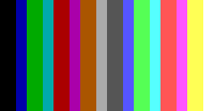
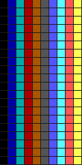
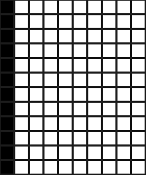
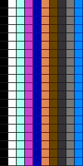
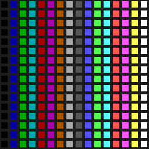
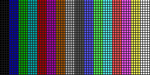
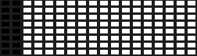
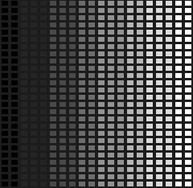
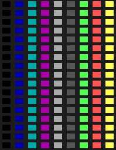
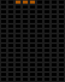

# Display protocol demo (wal.sh/tools/display v0.2.1)

A small, standalone test of the display binding: the user's `wal.sh/tools/display` spec v0.2.1, cited in docs/PROTOCOL.md §5.4. The spec is pinned in `../contract/wal-sh-display-0.2.1/`. The contract kit next to this directory (`../contract/`, see its README) has the schemas, fixtures, reference and conformance suite.

The demo has four parts:
- `relay.py`, a **local mock relay**. It serves the 12 presets of the pinned `capabilities.json`, each with its own lease.
- `source.py`, a **source**. It reserves a display and plays a demo on it (`bars`, `matrix`, `fishbowl` or `tetris`) in `pal16` (the default), `hex` or `rgb24`.
- `view.py`, a **viewer** (a sink). It folds every message through the contract's `reduce_event`, and draws the cells in ANSI truecolor in the palette `caps` announced, through the level rule.
- `producers.py`, the demos. It is unchanged: the user's `bars`, `matrix` and `fishbowl` are verbatim, alongside a self-playing `tetris` on the display's own field (a mock game, not the 17×9 SPEC engine). Every producer yields `w*h` palette indices, so pal16 frames are the indices themselves.

It needs Python 3.12 and `websockets` (the project venv has both). Everything stays on loopback. The source and the viewer refuse any other host, `wss://wal.sh` included.

```sh
cd contrib/displays
PY=/scratch/venvs/tetris-py/bin/python

$PY -m demo list                                  # the 12 presets and the demos
$PY -m demo run matrix -d ws2812                  # relay + source + viewer, 10 s
$PY -m demo run tetris -d hub75 --seconds 0       # forever; Ctrl-C to stop
$PY -m demo run fishbowl -d arcade --format hex --quiet

# the parts separately
$PY -m demo relay --port 8765 [--udp-port 2323] [--record session.jsonl] [--page display.html]
$PY -m demo view   -d green-building
$PY -m demo source fishbowl -d green-building --seconds 30 --format rgb24

$PY -m pytest -q -p no:cacheprovider demo contract   # the tests, conformance included
```

The default display in this repo is **green-building** (9×17, aspect 1.5, gap 0.35, cga, 30 fps): the user's choice for this repo. It is the default for the CLI, the examples, and the mock relay's own `default`. The spec's default is cga40; `relay --default cga40` restores it.

## The wire (v0.2.1)

- **viewer:** `{"op":"view","display":D}` (D is optional) gets `caps` back, carrying display, w, h, fps, format and 16 hex colours. Then comes `lease`, carrying display, holder and expires. Then every frame the holder sends, in `caps.format`.
- **source:**
  - `{"op":"reserve","name":N,"display":D,"ttl":T,"format":"pal16"|"hex"|"rgb24"}` gets back `granted` (lease, w, h, fps, format, palette, expires) or `busy` (holder, expires).
  - Frames renew the lease, and so does `{"op":"renew"}`.
  - `{"op":"release"}`, or closing the socket, ends it.
- **frames:**
  - pal16 is binary: `w*h` bytes of indices 0..15, with an optional 2-byte big-endian sequence prefix, which the relay strips.
  - hex is text: `h` lines of `w` hex digits, LF-terminated, with an optional blank line at the end.
  - rgb24 (`w*h*3`) is accepted from a source that reserved rgb24. The relay quantizes it.
  - BLP and MCUF packets are accepted as binary.
- **errors:** `not-holder`, `bad-frame-length`, `rate` (faster than fps, or a lower sequence), `bad-format`, `unknown-op`.
- **limits:** one holder per display. ttl ≤ 900 s from the last frame or renew, and on expiry every viewer gets `lease holder:null`, then a black frame. hub75 runs at 60 fps and the rest at 30. There are at most 32 viewers per display.
- **UDP:** with `--udp-port` (0 means any free port; the spec's port is 2323), BLP and MCUF packets arrive on loopback. The display is picked by width × height, and the sender holds it for 5 s.

## Relay options

`python -m demo relay` still takes `--host`, `--port` and `--page`. It adds:
- `--default D`: the display an omitted `display` resolves to (default green-building);
- `--udp-port N`: the BLP/MCUF listener (off if not given);
- `--record FILE`: every message in and out, as JSONL, flushed line by line, starting with a `meta` record of its capabilities. `python -m contract.check_session FILE` checks it;
- `--extra-display NAME=WxH[,fanout=hex][,palette=P][,fps=N]`: mock-only displays, for example the grid boundaries 1x1 and 256x256;
- `--fanout FORMAT` or `--fanout NAME=FORMAT`: the format the relay fans out (`caps.format`), pal16 or hex;
- `--seq-rule literal|serial`: literal (the spec's text) by default; see open question 1 in `../contract/README.md`;
- `--fps N`: lowers every display's fps, never raises it.

**Output:** the first line printed is `mock relay ws://HOST:PORT/tools/display/ws  (capabilities: http://HOST:PORT/tools/display/capabilities.json)`. With UDP it is followed by `udp HOST:PORT  (BLP, MCUF)`.

**SIGTERM** stops the relay as cleanly as Ctrl-C does.

**capabilities.json** is the pinned file with local endpoints, the relay's default, its displays (with fps and fan-out format) and `interop.udp_port`.

## Browser sink

With `--page`, the relay serves an HTML sink at `/tools/display/`. `?view=NAME` on the WebSocket URL subscribes on connect. The user's canvas page (inputs/display.html) predates v0.2.1 and expects RGB frames.

## Simulator: every preset, as it looks

`python -m demo sim` simulates a display: a demo plays on any of the 12 presets, or a relay's display is viewed as a remote sink. Frames go through the contract's `reduce_event`, the sink's fold: caps, lease, then each frame. Each cell is drawn with its preset's grid, cell aspect (width over height) and gap. The gap is drawn as dark masonry `#1C1C1C`, which is distinct from index 0 (black, unlit). Colours come from the palette through the spec's level rule, so gb shows 4 levels, mono 2 (the Blinkenlights lamps are on or off) and grey8 8 (arcade).

```sh
$PY -m demo sim                                        # tetris on green-building, ANSI, 90 frames
$PY -m demo sim -d all fishbowl --frames 60            # every preset in turn
$PY -m demo sim -d all bars --frames 1 --png media/gallery --no-ansi     # the gallery below
$PY -m demo sim -d green-building tetris --frames 60 --cell 8 --gif media --no-ansi
$PY -m demo sim -d dc32 --url ws://127.0.0.1:8765/tools/display/ws        # a remote sink of a running relay
```

Four renderers share one rasterizer (`render.py`):
- **ANSI:** truecolor half blocks. A pixel is one column and half a line, so cells keep their aspect, and gaps show once a cell is a few pixels.
- **PNG:** the last frame. Images fit 256×256 unless `--cell` sets the cell height.
- **GIF:** every frame, animated at the display's fps.
- **pygame window (`--window`):** only when pygame and a display exist.

**No pygame here.** The jail's venv has neither pygame nor Pillow (tkinter is missing too), there is no X, and nothing is installed from the network. So PNG and GIF are written with the standard library: `zlib` for PNG, re-telling docs/media/render_snapshots.py, and an LZW encoder for GIF, which `test_sim.py` checks with its own decoder. The `--window` path is untested here; with no pygame or no display, it says so and draws the rest.

`bars` (static; column x shows index x·16/w) shows how each palette's levels fold the 16 indices:

| preset | grid | aspect | gap | palette (levels) | kind | bars |
|---|---|---|---|---|---|---|
| cga40 (spec default) | 40×25 | 1.2 | 0 | cga (16) | text-mode |  |
| tetris | 10×20 | 1 | 0.12 | cga (16) | field |  |
| green-building (default here) | 9×17 | 1.5 | 0.35 | cga (16) | facade |  |
| dc32 | 10×18 | 1 | 0 | gb (4) | badge |  |
| gameboy | 10×18 | 1 | 0 | gb (4) | field |  |
| trs80 | 10×12 | 1 | 0.12 | mono (2) | text-mode |  |
| c64 | 10×20 | 1 | 0.12 | c64 (16) | field |  |
| ws2812 | 16×16 | 1 | 0.3 | cga (16) | panel |  |
| hub75 (60 fps) | 64×32 | 1 | 0.15 | cga (16) | panel |  |
| blinkenlights | 18×8 | 1.6 | 0.3 | mono (2) | facade |  |
| arcade | 20×26 | 1.3 | 0.3 | grey8 (8) | facade |  |
| remote | 9×17 | 1.5 | 0.35 | cga (16) | facade |  |

The self-playing tetris on the Green Building's 9×17 facade (60 frames): 

`test_sim.py` (36 tests) checks:
- the geometry, from aspect and gap;
- that masonry fills exactly the gap;
- that every preset draws only its palette's levels;
- a PNG round trip, and an LZW round trip through an independent decoder (including the 4096-code reset);
- that a GIF holds every frame;
- the ANSI shape;
- `sim -d all` on all 12 presets;
- that the remote sink's picture equals the local one;
- that every gallery PNG is reproducible pixel for pixel.

## What the tests check

`test_demo.py` has 45 tests, covering the mock's own behaviour:
- **Displays:** the 12 presets in the spec's table order; `caps` and `lease`; the relay's default for `view` and `reserve`; short palettes through the level rule.
- **Leases:** busy, not-holder (for frames, renew and release); release and close; expiry, then a black frame; ttl bounds (900, 901, 5000, 0, -1, 1.5, "10", 1.0).
- **Frames and errors:**
  - every error reason, with bad frames never reaching a viewer;
  - the sequence prefix stripped, a lower sequence dropped, and the wrap under both rules;
  - hex and rgb24 sources, and hex fan-out;
  - BLP and MCUF over WebSocket, and UDP by geometry;
  - malformed control.
- **Relay mechanics:** the viewer cap; `capabilities.json`; grid limits on extra displays; `--record` flushed live, and SIGTERM.
- **End to end:** every demo on 9×17 and 64×32, in every format, rendering alike.

`../contract/relay_conformance.py` runs the relay-neutral suite against this relay, launched through this CLI.

## Mock choices

The relay makes the choices listed under "Implementer choices" in `../contract/README.md`:
- the rate limit is a GCRA with 20% jitter tolerance;
- the 33rd viewer is closed with code 1013;
- malformed control gets `bad-format`;
- a ttl over 900 is clamped;
- `lease` is re-sent whenever `expires` changes;
- release sends no black frame;
- UDP geometry ties go to the first display in the spec's table order.

The open questions for the user are listed there too.
