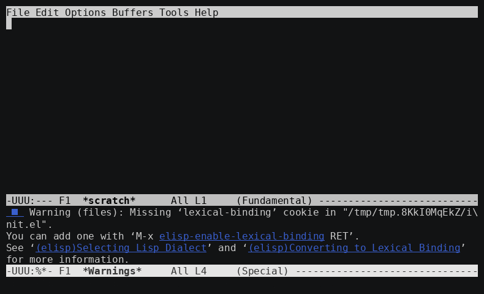

# tetris-mit.el: 17×9 Tetris from Emacs

`tetris-mit.el` plays the 17×9 Tetris of MIT's Green Building facade (153 windows, 17 rows × 9 columns, 30 FPS) from Emacs, and tests it. It speaks **contract v1** of the remote protocol, [`docs/PROTOCOL.md`](../../docs/PROTOCOL.md) (protocol version 1): newline-delimited JSON over TCP, on loopback by default.

**Contract v1.**
- **Versions.** A hello offers the versions in `tetris-mit-protocol-versions`, by default `(1 0)`. If a server refuses version 1 with a `version` error before its hello, as the draft-v0 server does, the client reconnects and says hello in version 0. The refused attempt never reaches the mode's handler. A v1 server only ever sees a v1 hello.
- **`client_role`.** The client acts on the server hello's `client_role`, not on the role it asked for, because an outer gatekeeper may demote a controller to a viewer (PROTOCOL §2, §9.3). `(tetris-mit-client-role PROC)` returns it.
  - A demoted `tetris-mit-remote` refuses keys and ticks, and its status line says "admitted as viewer: keys are off".
  - A demoted display controller stops playing.
  - A KAV replay fails with "the server admitted the controller as a viewer", without sending any events.
  - The local mirror stops unless it was admitted as a producer.
- **`events`.** A frame's `events` (E_k) are validated when present. The KAV driver compares each frame's E_k with the trace, and reports it as `KAV-NN: n/n digests match, f/f frame events match — PASS`. With a v0 server, which sends no events, only the digests are compared.

| Command | What it is | SPEC v1? |
|---|---|---|
| `M-x tetris-mit-remote` | Live play against the engine server. Keys become SPEC actions, and the frames that come back are drawn as colored cells, with a status line for score, level and lines. | **Yes.** The server's SPEC engine decides everything. |
| `M-x tetris-mit-kav` | Test driver. It replays known-answer vectors (`KAV-NN` = `spec/conformance/traces/NN-*.json`) through the engine server, and compares every frame digest. | Yes: it checks conformance. |
| `M-x tetris-mit-local` | Emacs's own `tetris` (tetris.el) on a 9×17 board in the SPEC palette. It can mirror its board to a display server. | **No.** The rules are tetris.el's. |

It needs Emacs 28.1 or later; it was tested with Emacs 31.1, in `-nw` and batch. The server needs Python 3 (standard library only) and this checkout. Nothing graphical is needed.

## Setup

```elisp
(add-to-list 'load-path "/path/to/17x9-Tetris/contrib/emacs")
(require 'tetris-mit)
;; the Python that starts private servers (tetris-mit-kav); or set $TETRIS_MIT_PYTHON
(setq tetris-mit-python "/scratch/venvs/tetris-py/bin/python")
```

`tetris-mit-root` defaults to the checkout that contains the file, and it locates the server and the traces.

To start a server by hand, from the repository root:

```sh
export PYTHONPATH=impl/python/engine:impl/python/sim
python -m tetris_sim.server --mode engine  --port 1709 --seed 42      # play
python -m tetris_sim.server --mode engine  --port 1709 --clock lockstep  # step / KAV
python -m tetris_sim.server --mode display --port 1710 --html wall.html  # show frames
```

The server binds `127.0.0.1` unless `--host` says otherwise. Protocol v0 has no authentication, so to reach a remote server, tunnel it: `ssh -L 1709:127.0.0.1:1709 host`.

## Live play: `tetris-mit-remote` (SPEC-faithful)

`M-x tetris-mit-remote` connects to `tetris-mit-host`:`tetris-mit-port` (default `127.0.0.1:1709`). With `C-u`, it asks for the host and port. Each connection is a new game from the server's seed.

| Key | Action |
|---|---|
| `←` / `→` | `left` / `right` |
| `↓` | `soft_drop` |
| `SPC` | `hard_drop` |
| `↑`, `c` | `rotate_cw` |
| `z` | `rotate_ccw` |
| `x` | `rotate_180` |
| `S-SPC` (graphical), `TAB`, `S-TAB`, `h` | `hold` |
| `.` | tick a lockstep server by one frame (`C-u N .` for N) |
| `g` / `q` | reconnect (new game) / quit |

These are the legacy bindings of SPEC §14, adjusted for how Emacs gets keys:
- **Taps.** Emacs never sees a key release, so every key sends a *press followed by a release* (PROTOCOL.md §4.4). The terminal's key repeat gives auto-repeat.
- **Hold.** A bare Shift press never reaches Emacs, so hold is on `S-SPC`, `TAB`, `S-TAB` and `h`.
- **Customizing.** Change the keys with `tetris-mit-remote-bindings`.

`tetris-mit-remote-frame-functions` is run with every frame message, which is useful for recording.

## Test driver: `tetris-mit-kav` (known-answer vectors)

`M-x tetris-mit-kav` asks for a trace file, or for a directory, which means all of its traces. It then starts a private lockstep engine server with `tetris-mit-python`. With `C-u`, it uses an existing lockstep server instead. For each trace, it:
1. sends the trace's seed, in the controller's `hello`;
2. sends the trace's events, each just before the tick that runs its frame;
3. recomputes the digest of every frame it receives from the frame's rows;
4. compares those digests with the trace's.

The `*tetris-mit-kav*` buffer shows progress and the final frame of each trace, then the result:

```
KAV-08: 131/131 digests match — PASS
```

The traces are read in place and never copied. From Lisp, use `(tetris-mit-kav-replay FILES [HOST PORT BUFFER])` or `(tetris-mit-kav-run FILE HOST PORT)`. Both return plists with `:pass`, `:matched`, `:total` and `:line`.

**Batch entry point, for CI.** This is not wired into `bin/verify.sh` yet.

```sh
emacs --batch -l contrib/emacs/tetris-mit.el -f tetris-mit-kav-batch \
      spec/conformance/traces/            # or individual TRACE.json files
# [--host H --port P] uses an existing lockstep server instead of a private one
```

It prints one `KAV-NN: …` line per trace, then `PASS: n/n KAVs pass`. It exits with 0 if every trace passes, 1 if any fails, and 2 on a usage or setup error. The gate could later call Emacs as a conformance client this way.

## Local play: `tetris-mit-local` (tetris.el rules, NOT SPEC v1)

`M-x tetris-mit-local` runs tetris.el on a 9-wide, 17-tall board, with its pieces in the SPEC §4.1 colors. Everything else is tetris.el's:
- rotation: its own tables, with no kicks;
- scoring: points per piece placed, and nothing for lines;
- speed and piece selection;
- no hold, ghost piece, flash or game-over animation.

The keys are tetris.el's: the arrows, `SPC`, `p` to pause, `n` for a new game and `q` to end it.

**How it adapts tetris.el.** These facts were verified by reading the installed Emacs 31.1 `lisp/play/tetris.el` and `gamegrid.el`. They were not re-checked against emacs-mirror master.
- The board size **is customizable**: `tetris-width` (default 10) and `tetris-height` (default 20) are `defcustom`s. They are global variables, though, so `tetris-mit-local` sets them buffer-locally, after `tetris-mode` has killed local variables. Your global `M-x tetris` is not affected.
- `tetris-next-x` and `tetris-score-x` are plain `defvar`s, computed **once, at load time**, from the global width. `tetris-mit-local` recomputes them.
- Colors come from `tetris-x-colors` (RGB in 0..1, for graphical displays) and `tetris-tty-colors` (color names). Both are indexed by shape number, and `tetris-display-options` reads them when `gamegrid-init` runs. So `tetris-mit-local` sets both from the SPEC palette, then initializes gamegrid again.
- A gamegrid cell is one buffer character, whose code is the cell value: 0–6 for the shapes, 7 blank, 8 border, 9 space. A display table and a face table turn it into a glyph or a colored face.
- `tetris-shapes` indices 0–6 are O, J, L, Z, S, T, I. `tetris-mit-local-shape-codes` holds this map, and a test checks it against the SPEC geometry.

**Mirroring to a display server.** Use `C-u M-x tetris-mit-local`, set `tetris-mit-mirror`, or run `M-x tetris-mit-local-mirror-start` in the game buffer. Every grid update is then sent as a protocol `frame` to `tetris-mit-display-host`:`tetris-mit-display-port`. Updates within 1/30 s are coalesced, so no more than 30 frames per second are sent (SPEC §2.3), and a board that did not change is not re-sent. Each frame is paired with a `state` that carries tetris.el's score and row count, and level 0, because tetris.el has no levels.

```sh
python -m tetris_sim.server --mode display --port 1709 --html wall.html   # ANSI with --ansi
```

## Emacs as a display: `tetris-mit-display.el`

`tetris-mit-display.el` makes Emacs itself a SPEC §2.3 Display. Its buffer is the facade: **9 cells wide and 17 tall**, with row 0 at the top (SPEC §2.1). Every cell has **one overlay**, built once. A frame repaints only the overlays whose color changed, with face specs cached per color. After warm-up, a frame allocates no conses, strings or vectors, and ERT checks this. The faces are RGB backgrounds: exact in a GUI or on a truecolor terminal. In `emacs -nw` on a 256-color terminal, Emacs maps them to the nearest tty color; for example, `#ffaa00` becomes `color-214`.

```elisp
(require 'tetris-mit-display)
M-x tetris-mit-display     ; viewer of tetris-mit-host:port; C-u to pick host/port/role
```

**Frame sources.** They are pluggable.

| Source | API |
|---|---|
| A protocol server, as viewer or controller | `(tetris-mit-display-connect HOST PORT ROLE [SEED])`. As a controller, the `tetris-mit-remote-bindings` keys play in the display buffer. |
| An in-process provider, such as impl/elisp's local engine | `(tetris-mit-display-set-provider FN)`. FN is called 30 times a second with no arguments. `nil` stops polling. |
| Pushing frames | `(tetris-mit-display-show ROWS [FRAME-NO STATE])` returns the number of overlays it repainted. |

**The frame format** is the `rows` payload of a protocol `frame` message (PROTOCOL.md §3): a vector of 17 rows, top first, each a vector of 9 `[R G B]` vectors of integers in 0..255. A provider returns one of:
- `nil`, meaning no new frame;
- ROWS;
- an alist shaped like a frame message: `((rows . ROWS) (frame_no . N) (state . ((score . S) (level . L) (lines . N) (phase . "playing"))))`. `frame_no` and `state` are optional.

**Reservable identity.** An outer reservation system can register this display, and route connections through its gatekeeper. That system is a separate project, and none of its logic lives here.
- `tetris-mit-display-id`, default `"emacs-17x9"`, and `tetris-mit-display-kind`, default `"emacs"`, identify the display. `(tetris-mit-display-identity)` returns the registration alist, and `emacs --batch -l tetris-mit-display.el -f tetris-mit-display-identity-batch` prints it as JSON.
- `tetris-mit-gatekeeper-endpoint` and `tetris-mit-gatekeeper-token-source` (a string or a function) are the gatekeeper's settings.
- `tetris-mit-gatekeeper-function` is the hook. It gets a plist `(:endpoint :token :host :port :role :identity)` and returns the `(HOST . PORT)` to connect to, or `nil` for a direct connection. The token is read only when this hook is set.

**Text-only snapshots.** `M-x tetris-mit-display-snapshot` (`S` in the buffer) writes three files:
- `BASE.ans`: ANSI truecolor background blocks, byte for byte as `tetris_sim.ansi.frame_to_ansi` writes them;
- `BASE.txt`: SPEC palette codes, with `?` for any other color;
- `BASE.json`: `{"format":"17x9-tetris-snapshot","spec_version":1,"display_id","display_kind","frame_no","digest","rows":[...],"state"}`. The `digest` is the SPEC §9.4 digest of `rows`.

The docs agent's stdlib renderer makes a PNG from the JSON.

Snapshots are headless and reproducible: the same seed and events always give byte-identical files.

```sh
emacs --batch -l contrib/emacs/tetris-mit-display.el \
      -f tetris-mit-display-snapshot-batch SEED EVENTS OUT [--frames N] [--host H --port P]
# EVENTS: a JSON array of [frame, action, down]; or an object with "events" (and
# "frames"), so a conformance trace works; or "-" for none.
# Without --port, it starts a private lockstep engine server ($TETRIS_MIT_PYTHON).
```

The CLI plays the events on the SPEC engine, shows every frame, and snapshots the last frame (number FRAMES−1). It prints `snapshot OUT.{json,ans,txt}: seed S, frame F, digest D`. ERT checks that D equals the Python engine's digest of the same frame.

### Recording: the display at Green Building geometry



[`media/green-building-9x17.cast`](media/green-building-9x17.cast) (asciicast v2, 77 KB) and its GIF (254 KB, 39 s) show the stock overlay display, `tetris-mit-display.el`, unpatched, in `emacs -nw` on a truecolor terminal (80 × 24).

**Geometry.** The grid is the facade's: **9 windows wide and 17 tall**, 153 overlays, with row 0 at the top. Each window is 3 columns × 1 line: the recording sets the existing option `tetris-mit-cell-string` to three spaces. The GIF's terminal cell is 9.6 × 19.2 px (DejaVu Sans Mono, 16 px, line height 1.2), so a window is 28.9 × 19.2 px, **1.5 : 1**, the cell aspect of the Green Building preset (`green-building` in the wal.sh display spec v0.2.1). The preset's **gap of 0.35** (masonry between windows) is **not drawn**: the display paints adjacent cells edge to edge, so same-coloured neighbours merge. Drawing the masonry would need a change to the display, which this recording deliberately does not make.

**The game** is SPEC v1 on the Python engine server; nothing on the display is scripted. [`media/green-building-game.json`](media/green-building-game.json) is a conformance trace (seed, inputs, and the digest of all 923 frames), written by [`media/green_building_game.py`](media/green_building_game.py) from the demo bot of `tetris_sim`:
- **frames 0–539:** seed 42 with `Bot(pace=3, think=6, batch_shifts=False)`, the `python -m tetris_sim --bot` demo, so these frames are the same game as the [docs/media snapshots](../../docs/media/README.md);
- **from frame 540:** each piece is hard-dropped 6 frames after it spawns, so the stack tops out quickly;
- **after game over:** no input.

The trace shows the countdown (frames 0–89) and 8 line clears, one of them a double (at frames 158, 224, 287, 349, 383, 436, 490 and 537). It also shows the level-up at frame 354, the top-out at frame 584 with its fill, 150-frame white wait and fall-down, the countdown of game 2 (without the boot black frame, QUIRK-10), and game 2's first piece in an empty well (frame 892 on). There are 923 frames, 30.8 s at 30 FPS.

**How it is played.** [`media/record-game.el`](media/record-game.el) runs inside `emacs -nw`:
1. It starts a private lockstep engine server (`tetris-mit-start-server`).
2. It connects as the controller with the trace's seed, and sends the trace's inputs as protocol events and ticks. It paces them like a controller that owns time: at most 5 frames per tick, and at most 3 s ahead of the screen.
3. It shows the frames through `tetris-mit-display-set-provider` at 30 FPS.
4. It checks every frame's SPEC §9.4 digest against the trace.

The status line under the grid is the display's own. The last screen of the cast is the result:

```
green-building-emacs: 923/923 digests match the trace, 0 stalls -- PASS
played 923 frames in 31.9 s (30.8 s at 30 FPS)
```

**Timing.**
- A "stall" is a 1/30 s tick with no frame ready.
- A loaded host also runs Emacs's 30 FPS timer late, and no stall counts that. The second line shows it: this take was made at a load average of 8 to 9 on 4 CPUs, under `nice`, and played 3.5 % slow.
- The cast opens on the empty display. `record.sh` folds the startup into the first frame at t = 0: that is Emacs starting, drawing `*scratch*`, loading the display, and launching the server, 1.2 s here. The fold keeps the output byte for byte and changes only the timestamps. `record-game.el` marks where the game starts, with an invisible terminal-title sequence.
- The rest is timed as played. agg's idle limit (6 s) is longer than the game's longest still stretch (the 5 s white wait), so the GIF keeps the recorded timing.

**Reproduce**, from the repository root:

```sh
PY=/path/to/python contrib/emacs/media/record.sh          # trace, cast, gif
contrib/emacs/media/record.sh cast                         # or one step: trace | cast | gif
```

It needs Emacs 28.1 or later, asciinema 3.x, and agg: on FreeBSD, `pkg install asciinema asciinema-agg`. The `agg` package is Anti-Grain Geometry, not this. It also needs a Python that can import the engine, with no extra packages. It uses the settings of `docs/media/record_casts.sh`: `asciinema rec --headless -f asciicast-v2`, and agg with DejaVu Sans Mono and line height 1.2. Emacs runs as `emacs -Q` plus a throwaway init directory whose only line, `(setq xterm-query-timeout nil)`, skips xterm.el's terminal queries, which a headless recorder never answers. The inputs, and so every frame, are deterministic. Only the wall-clock timing varies with host load, and any stall shows in the summary. The recording was made on FreeBSD 15.1 with Emacs 31.1, Python 3.12.14, asciinema 3.2.1 and agg 1.9.0. Nothing is uploaded.

## Emacs as a display source: `tetris-mit-display-source.el`

`tetris-mit-display-source.el` is the **source** side of the user's display protocol, **wal.sh/tools/display v0.2.1**. The protocol is pinned verbatim at `/scratch/work/tetris-parallel/inputs/wal-sh-display-0.2.1/` (`spec.md` and `capabilities.json`), and PROTOCOL.md §5.4 cites it. Emacs reserves a display on a relay, sends frames, renews when it is idle, and releases on quit or kill-buffer. It never draws: a browser sink or the building does.

| Command | Frames it sends |
|---|---|
| `M-x tetris-mit-display-source-game` | whatever the overlay display shows: the engine server, or an in-process provider |
| `M-x tetris-mit-display-source-tetris` | stock tetris.el's playing field, in its buffer |

**Defaults.** This repository reserves **`green-building`** (9 × 17, the facade) by default; the spec's own default is `cga40`. The format is **`pal16`**, and the URL is a local mock relay, `ws://127.0.0.1:8765/tools/display/ws`.

**On the wire (spec v0.2.1).**
- **`reserve`** carries `format`: `pal16` or `hex` (`tetris-mit-display-source-format`). A source never sends `rgb24`: the spec leaves that to relays and shims.
- **`granted`** gives the grid (w × h), the fps, the format and the display's **16-entry palette**.
- **A pal16 frame** is a binary message of w·h bytes, one palette index 0–15 per cell, row-major, row 0 at the top.
  - With `tetris-mit-display-source-sequence`, a 2-byte big-endian prefix carries the frame count modulo 65536.
  - Beware the wrap: the spec's rule, read literally, has the relay drop every frame after 65535 → 0 (with `rate`) until the lease ends. The mock relay does this, and the test shows it.
- **A hex frame** is a text message of h lines of w lower-case hex digits, each ending in LF.
- **The relay's errors**: `not-holder` loses the lease. `bad-frame-length`, `bad-format`, `rate` and `unknown-op` are recorded and counted (`last-error`, `rejected`), and the lease is kept.

**Quantization is the source's job** (the spec's NR-QUANT). Each colour maps to the nearest of the 16 palette entries that `granted` announced, by squared sRGB distance, with ties to the lower index. The map is cached per colour, so the SPEC palette becomes a direct table. On cga it is:

| SPEC colour | `.` | `W` | `I` | `J` | `L` | `O` | `S` | `Z` | `T` | `G` (ghost) |
|---|---|---|---|---|---|---|---|---|---|---|
| cga index | 0 | 15 | 11 | 1 | 6 | 14 | 2 | 4 | 5 | 0 |

L's orange is equally near entries 6, 12 and 14, so it takes 6. The ghost is dark enough to be unlit.

**Safety.** Only loopback relay URLs are accepted unless `tetris-mit-display-source-allow-remote` is set. Nothing here connects to wal.sh.

**Transport.** websocket.el (GNU ELPA or MELPA) is needed for a real connection. It is **not installed** where this was built, so the tests take one of two routes:
- **A fake link** (`tetris-mit-display-source-make-link`) covers framing, pacing and the lease.
- **`test/display-relay-bridge.py`** is a small WebSocket bridge (Python with `websockets`), which lets ERT drive the real source against the **displays kit's v0.2.1 mock relay**. Both of these tests skip when that relay is not in the checkout, and until contrib/displays' v0.2.1 is merged, `TETRIS_MIT_DISPLAYS_DIR` can point at it:

```sh
D=/path/to/contrib/displays   # the displays kit with its v0.2.1 relay and fixtures
TETRIS_MIT_DISPLAYS_DIR=$D TETRIS_MIT_DISPLAY_FIXTURES=$D/contract/fixtures \
  emacs --batch -Q -L contrib/emacs -L contrib/emacs/test -l ert \
    -l contrib/emacs/test/tetris-mit-display-source-test.el -f ert-run-tests-batch-and-exit
```

**Tests.**
- **The user's boundaries**, at 9 × 17:
  - a pal16 frame of w·h or w·h+2 bytes decodes, and w·h−1, w·h+1, w·h+3 and empty frames are `bad-frame-length`;
  - index 15 is a cell, and 16 and 255 are `bad-format`;
  - the sequence goes 65534, 65535, 0;
  - pal16 and hex frames of the same cells decode to the same cells, with and without hex's closing blank line.
- **The kit's fixtures**, when present: `frames.json` (every pal16 and hex case), `equivalence.json` (the source's encoders reproduce both forms byte for byte) and `quantize.json` (224 cases on six palettes).
- **The mock relay**, over the bridge:
  - `granted` gives the green-building grid and the cga palette, and a viewer receives the right indices;
  - the relay drops the frame numbered 0 after 65535 with `rate`;
  - a 152-byte frame and a byte of 16 are refused, with the lease kept;
  - after release, a hex session is fanned out as pal16.

## Play on a reserved display

This is the user's scenario for experiment 002, signed display lease keys: "the User interacting with interactive programs like tetris then the event loop interacting with Display". The reservation system issues a **dlk1 lease key**: one principal, one display, one time window, and the formats allowed. The format is defined in `/scratch/work/tetris-parallel/inputs/dlk1-display-lease-key.md`. A relay started with lease secrets checks the key offline and never calls the reservation system. Emacs's part, in `tetris-mit-reserved.el` and `tetris-mit-display-source.el`, has four pieces:
- **The key goes in `reserve`.** It comes from the `:key` argument, `tetris-mit-display-source-key`, or `tetris-mit-display-source-key-file`. The key is a bearer credential for its window, so keep it out of version control.
- **The client honours the key.** It decodes the claims but does not verify them, because only the relay holds the secret. It then:
  - reserves the key's display;
  - reserves a format the key allows (`fmt`), switching to one if needed;
  - refuses a key whose slot has already ended;
  - stops at the key's `exp`.

  It also honours the display's capabilities from `granted`: the grid, the 16-entry palette (quantizing to it), the format, and the fps. The fps is kept with a 10 % margin (`tetris-mit-display-source-pace-margin`), so the relay's rate limit never drops a frame.
- **A refused key stops the source.** On `{"op":"error","reason":"unauthorized","detail":CODE}`, the source stops and the echo area shows `Display D refused the lease key: CODE (not retrying)`. CODE is `missing`, `malformed`, `unknown-kid`, `bad-signature`, `bad-claims`, `wrong-display`, `not-yet`, `expired` or `format-not-allowed`.
- **The slot ends at `exp`.** The source stops sending and says `Display D: the reserved slot ended at HH:MM:SS; frames stopped`. A `not-holder` or a `lease` with holder null that follows is taken as that end, not as a lost lease.

**Transport.** websocket.el is used when it is installed. Otherwise the transport is [`display-relay-bridge.py`](display-relay-bridge.py), a small bridge written in Python with `websockets`, run with `tetris-mit-python`. The default `tetris-mit-display-source-transport` is `auto`, so this works in the jail, where websocket.el is absent.

**Manual steps.**
1. Start a relay. A relay with lease secrets verifies keys; the displays kit's mock without them carries the key unchecked.

   ```sh
   (cd contrib/displays && python -m demo relay --port 8765)
   ```
2. Start the engine server:

   ```sh
   PYTHONPATH=impl/python/engine:impl/python/sim python -m tetris_sim.server --mode engine --port 1709
   ```
3. In Emacs, point to the key, then play:

   ```elisp
   (setq tetris-mit-display-source-key-file "~/keys/green-building.dlk1")
   M-x tetris-mit-play-reserved RET
   ```

   It asks for the engine host and port, the display (green-building), the relay URL, and the key (empty means the option or the file). Then it:
   - connects the overlay display as a viewer of the server;
   - starts `tetris-mit-display-source-game` with the key;
   - opens `M-x tetris-mit-remote`, where you play with the arrows, SPC, z/x/c and TAB.

   Whatever the overlay display shows goes to the reserved display. `M-x tetris-mit-display-source-stop` releases the lease. You can also do the three steps by hand: `C-u M-x tetris-mit-display`, then `M-x tetris-mit-display-source-game`, then `M-x tetris-mit-remote`.

**Unattended, for the reservation harness** (its S2 scenario, the Emacs variant). A scripted user plays one KAV on a lockstep server at 30 frames per second, as the controller: it sends the KAV's key presses and releases, and one tick per frame.

```sh
TETRIS_MIT_PYTHON=/path/to/python \
emacs --batch -Q -L contrib/emacs -l tetris-mit-reserved -f tetris-mit-play-reserved-batch \
      --relay ws://127.0.0.1:PORT/tools/display/ws --key-file KEY.dlk1 \
      [--trace spec/conformance/traces/07-hard-drop.json] [--display green-building] \
      [--host 127.0.0.1 --port ENGINE_PORT]
```

- Without `--port`, the command starts a private lockstep engine server.
- It checks the KAV's digests on the Emacs display.
- A relay viewer, attached through the bridge with no key needed, records what the display receives. Each of those frames must be one the Emacs display showed, in order.
- It prints a report, then `RESULT {json}`, and exits with one of these codes:

| Exit | Meaning |
|---|---|
| 0 | PASS |
| 1 | FAIL |
| 2 | usage or setup error |
| 3 | `unauthorized`: the report shows the detail |
| 4 | the key's slot ended during the game |

Against the mock relay (no lease secrets), KAV-07 gives:

```
play-reserved: KAV-07: 121/121 digests match on the Emacs display
play-reserved: source sent … frames (… dropped, … refused); relay viewer saw …, each one a displayed frame, in order
PASS
```

- **"dropped"** counts frames that the source's own pacing replaced: the latest wins.
- **"refused"** counts frames the relay dropped with `rate`. The source sends at most once every 1.1/fps seconds, but under host load the pipe to the bridge can deliver two frames together, and the relay then drops the early one. Every frame sent is either shown or refused. The ERT test allows up to 10 % refusals, and the verdict does not depend on them.

## Driving the real building on Sep 29

The facade is just another SPEC §2.3 `Display`. Either server can drive one, with `--display module:attr`. This takes any object with `send(frame)` and `makeframe()`, such as a subclass of `impl/python/legacy/utilities/display.py`'s `Display`, and a legacy one is handed a legacy `Frame` of `Color`. Point it at whatever the hack exposes:

```sh
# SPEC game on the building, played from Emacs with M-x tetris-mit-remote:
python -m tetris_sim.server --mode engine  --display hack_building:BuildingDisplay
# any producer (tetris-mit-local's mirror, another program) on the building:
python -m tetris_sim.server --mode display --display hack_building:BuildingDisplay --html backup.html
```

Things to keep in mind on the day:
- **Pacing.** Frames are validated, and paced to at most 30 per second.
- **Mapping.** The row→floor and column→bay mapping is still provisional (SPEC §10.4). Confirm it at the hack before trusting the orientation.
- **Network.** Keep the server on loopback on the machine that owns the building link, and tunnel to it.

## Tests

From the repository root. On a shared host, wrap each command in `nice -n 10 lockf -k -t 7200 /scratch/locks/heavy.lock …`.

```sh
# ERT: codec, digests, rendering, keys, tetris.el geometry, and integration
# against the Python server on localhost (remote, KAV replay, the batch
# entry point, the local mirror)
TETRIS_MIT_PYTHON=/scratch/venvs/tetris-py/bin/python \
  emacs --batch -Q -L contrib/emacs -l ert \
    -l contrib/emacs/test/tetris-mit-test.el -f ert-run-tests-batch-and-exit

# the Python side of the protocol and server
PYTHONPATH=impl/python/engine:impl/python/sim python -m pytest impl/python/sim/tests
```

The integration tests skip themselves when no Python is found.
