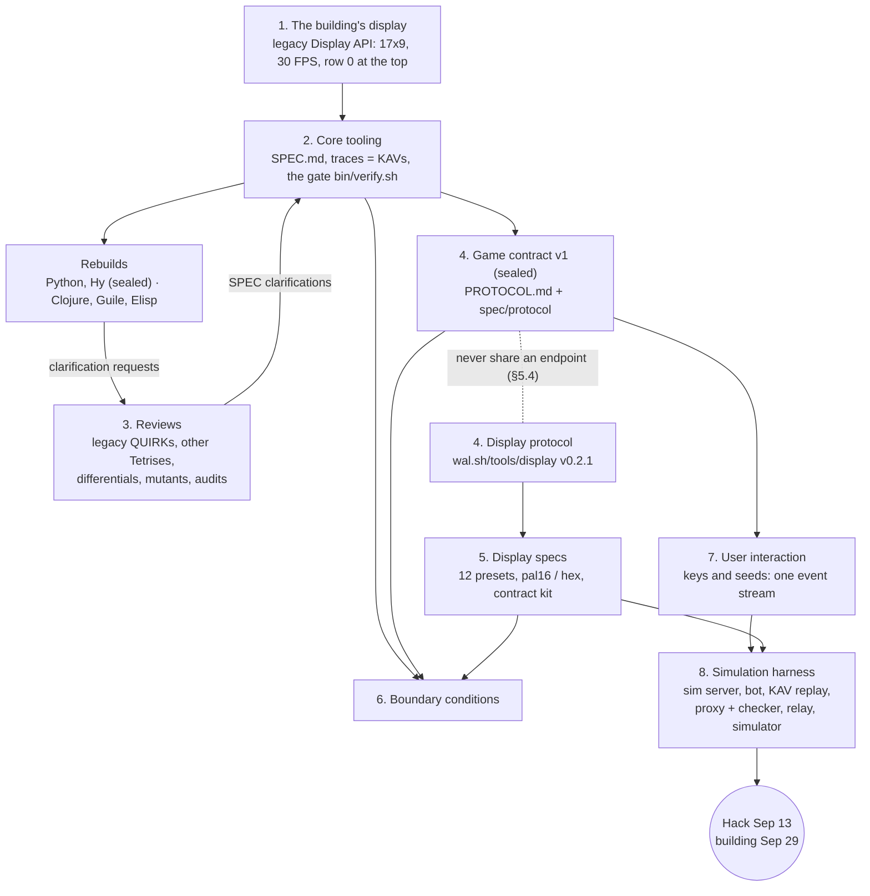
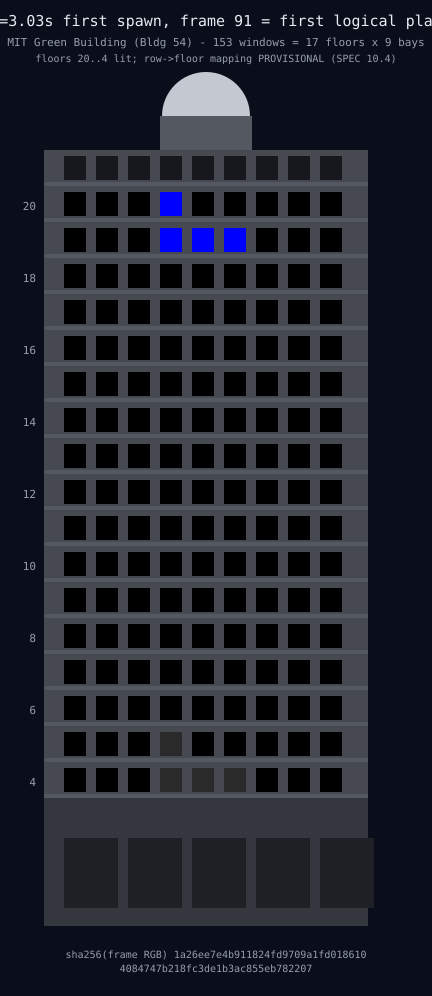
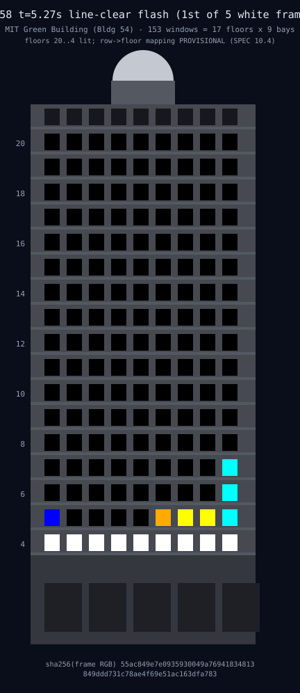
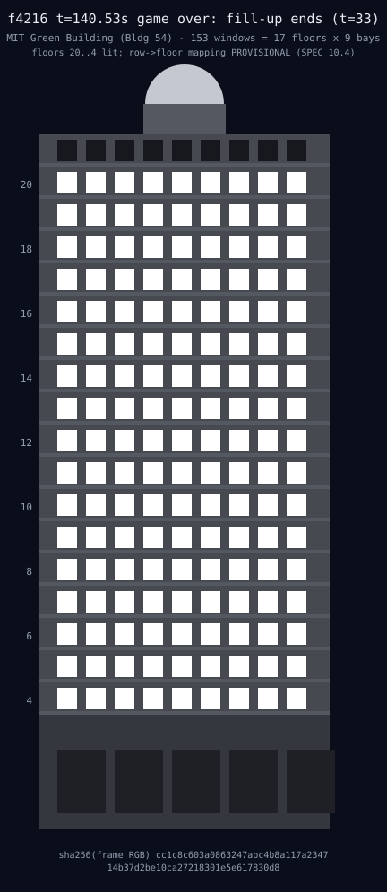
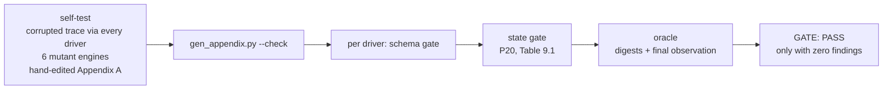
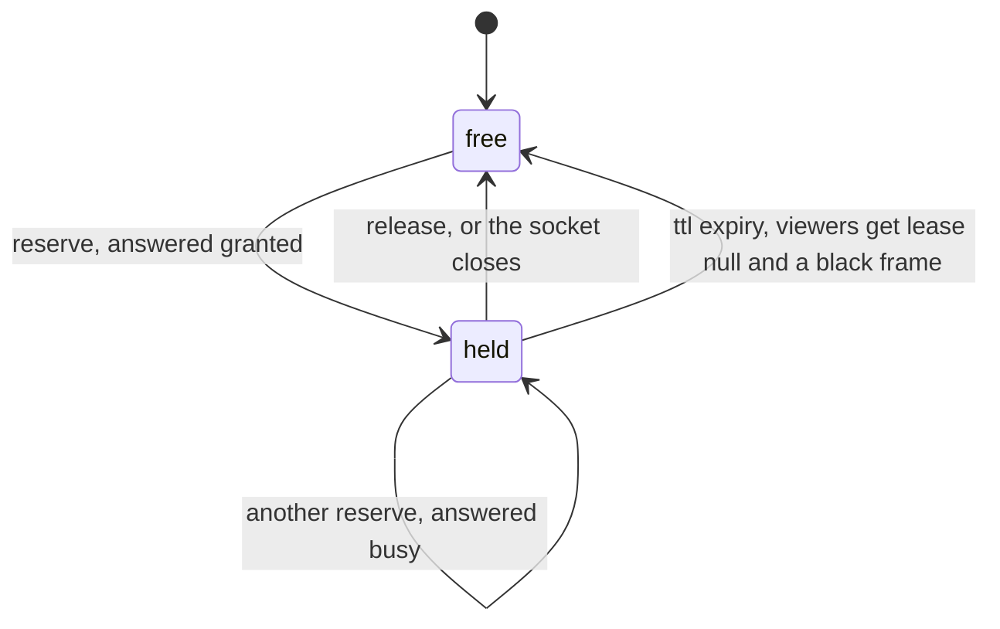
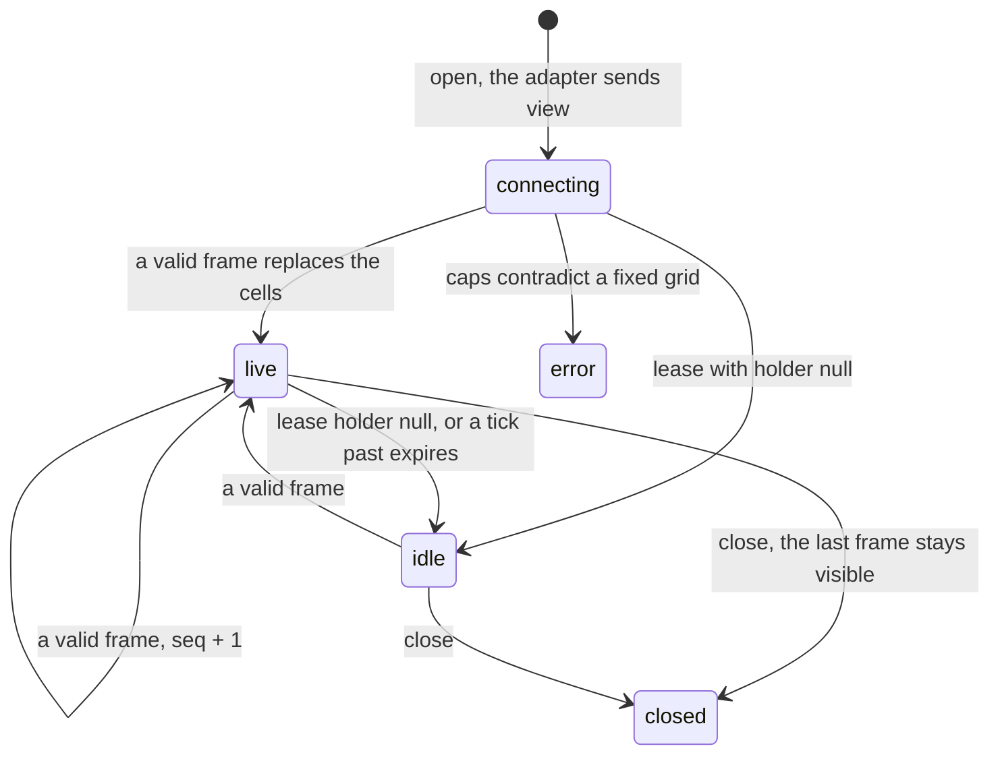
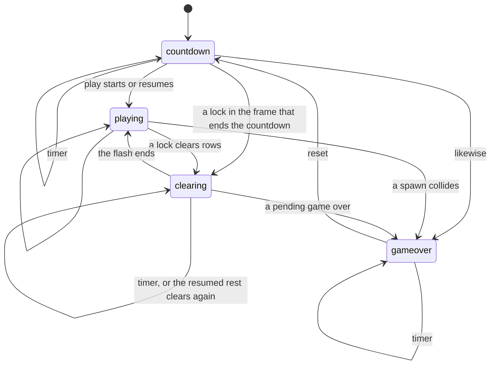
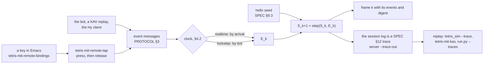
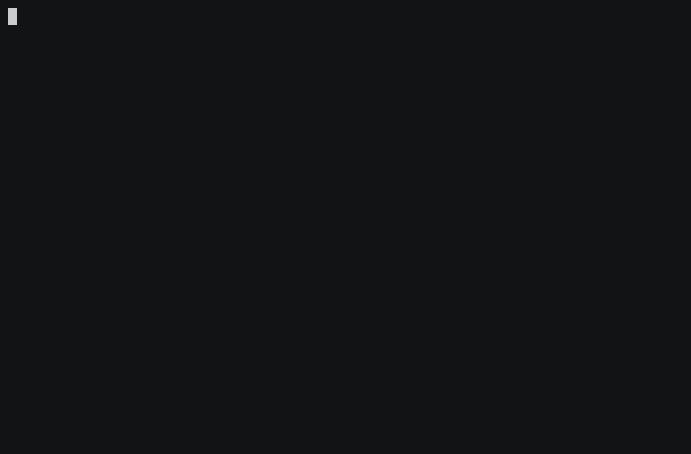

# How this was done: the 17×9 Tetris process

This page walks through how the 17×9 Tetris rebuild was actually done, from the first look at the building's display to the harness that drives a display with nobody at the keyboard. It is for engineers picking up the code and for people at [Sundai Hack 140](events/2026-09-13-sundai-hack-140.md) (Sun Sep 13) who want to know what exists and how far to trust it.

**Conventions.**
- Every claim points at a file, a commit (short sha), a tag, an experiment or a log line. Reproduction commands are copied from the commit notes (`git log --notes`), which also record the output observed and the supported cell (FreeBSD 15.1 amd64, Python 3.12.14 in `/scratch/venvs/tetris-py`).
- The user's words are quoted verbatim, typos included, with the UTC time of the message. Commit dates are the committer's local time (−04:00).
- Snapshot: 2026-09-11, `main` at `2974879`; refreshed at each merge to main.
- Anything not yet on `main` is marked ***(in progress on branch X)***. Those branches are local worktrees under `/scratch/worktrees/17x9-Tetris-*`, and most of them are not pushed, so they are named, not linked.
- A shareable page, "Seventeen by Nine", is at <https://claude.ai/code/artifact/ac56b038-af48-45cc-8c0b-0b30a1ed46d5>. It is private until the user shares it.
- "Heavy" commands (the full gate, thorough property runs, the JVM) ran under `nice -n 10 lockf -k -t 7200 /scratch/locks/heavy.lock …` on a shared host; the prefix is left out below.

## Overview



| Stage | Where it lives | State on `main` |
|---|---|---|
| 1 Display | [`impl/python/legacy/`](../impl/python/legacy/), SPEC §2, §10.4 | done; the row→floor mapping is TBD until the hack |
| 2 Tooling | [`SPEC.md`](../SPEC.md), [`spec/`](../spec/), [`bin/verify.sh`](../bin/verify.sh), [`Makefile`](../Makefile) | v2 sealed; the v3 draft is on main, its seal pending |
| 3 Reviews | [`experiments/`](../experiments/), [`FREEBSD-TETRIS.md`](FREEBSD-TETRIS.md), SPEC Appendix B, [`spec/conformance/audit.py`](../spec/conformance/audit.py) | 001–007 on main; 008–009 on branches |
| 4 Protocols | [`PROTOCOL.md`](PROTOCOL.md), [`spec/protocol/`](../spec/protocol/), [`contrib/displays/contract/`](../contrib/displays/contract/) | contract v1 **sealed** (`cd569ef`); the display v0.2.1 pin and kit are on main |
| 5 Display specs | [`contrib/displays/`](../contrib/displays/) | on main: mock relay, contract kit, Clojure core, simulator |
| 6 Boundaries | SPEC Table 9.1, [`spec/protocol/transcripts/`](../spec/protocol/transcripts/) `e*`, [`contrib/displays/contract/fixtures/`](../contrib/displays/contract/fixtures/), [`relay_conformance.py`](../contrib/displays/contract/relay_conformance.py) | on main |
| 7 Interaction | SPEC §5, §9, §14; PROTOCOL §2–§4; [`contrib/emacs/tetris-mit.el`](../contrib/emacs/tetris-mit.el) | on main (contract v1 wire) |
| 8 Harness | [`impl/python/sim/`](../impl/python/sim/), [`docs/media/`](media/README.md), [`contrib/displays/demo/`](../contrib/displays/demo/) | on main, except the Clojure viewer and the `tetris.el` screenshots |

---

## 1. The initial look at the building's display

**What we did and why.** The project started on 2026-09-10, when the user pasted the Sundai Hack 140 event page and asked (21:21Z): "swap our version to clojure or hy. add an event note:". The page said: "MIT's Green Building Tetris installation is back: 153 individually lit windows across a 21-story tower, running the game at 30 FPS", and that teams would work "from the live Tetris repo and its display API". So the first job was to find out what that display API is. The upstream repo, [Nevin-Thinagar/17x9-Tetris](https://github.com/Nevin-Thinagar/17x9-Tetris), was forked to `aygp-dr/17x9-Tetris` at `e37f28d` and read before anything was run.

**What the upstream had.** The upstream is a single Python game plus a small display library (commits from 2026-04-29 to 2026-09-10, `7386fd9`…`e37f28d`):

- `tetris.py`: the game loop. It opens with `FPS = 30 # Screen refresh rate (CANNOT BE MODIFIED)` and defines the palette as `Color` constants (white, cyan, blue, orange, yellow, green, purple, red, and a gray for the ghost).
- `utilities/display.py`: the display API. `Color` clamps each channel with `max(0, min(int(value), 255))`. `Frame` is a numpy array of `Color` with `DISPLAY_ROWS = 17` and `DISPLAY_COLS = 9`. `Display` is an abstract class with `send(frame)` ("Send the frame for display at the next frame start") and `makeframe()`.
- `utilities/dummy.py`: a pygame `DummyDisplay` that draws each cell as a 50 × 50 rectangle.
- `utilities/input_manager.py`: the keyboard and game-controller bindings.
- The README's own rule: "The `Display.send()` function should be called *at most* at 30 FPS".

Commit `1821d07` moved `tetris.py` and `utilities/` to [`impl/python/legacy/`](../impl/python/legacy/), byte-identical (sha256 checked). That tree is the oracle for everything that follows, and it is never edited.

**The facade as a display.**
- **153 windows = 17 rows × 9 columns**, one lit window per cell. Row 0 is the top row (SPEC §0, §2.1).
- **30 FPS**: a producer never calls `send` more than 30 times a second (SPEC §2.3).
- **The palette** is ten colours: black, the white of borders, flash, fill and digits, seven piece colours, and the ghost gray `(42, 42, 42)` (SPEC §4.1, taken from the legacy constants).
- **The shape of a window** came later, from the user's display table (2026-09-11, 06:42Z): `green-building`, 9 × 17, cell aspect 1.5 and gap 0.35, "Building 54: wide windows with masonry between them". §5 covers the presets.

**How SPEC §2 came about.** SPEC v1 (`0e06ce3`, 2026-09-10) was written by reading the legacy in full. Its note records that "Read impl/python/legacy/tetris.py and utilities/ in full; traced every handler". SPEC §2 restates the legacy display contract language-neutrally:
- §2.1: a Frame is 17 × 9 `Color`;
- §2.2: channels are clamped as `Color._doset` does, and the v3 draft adds that conversion truncates toward zero;
- §2.3: `makeframe` and `send`, at most 30 FPS;
- §2.4: the in-memory representation is not normative.

The building itself stayed an open question. SPEC §10.4 says the mapping from rows to floors and columns to bays is **TBD** "to be confirmed at the hack on 2026-09-13". Until then, simulators use a *provisional* mapping and label it as such: row `r` → floor `20 − r` (rows 0–16 → floors 20–4), column `c` → bay `c + 1`.

**Media.** [`docs/media/snapshots/`](media/snapshots/) holds 16 moments of the seed-42 bot game. Each moment has a facade view (Building 54 with the provisional mapping) and a grid view that is exactly the legacy `DummyDisplay` pixels (`018b1f3`). Every file carries the SPEC §9.4 digest of its frame.

| First spawn, frame 91 | Line-clear flash, frame 158 | Game-over fill ends, frame 4216 |
|:-:|:-:|:-:|
|  |  |  |

**Reproduce.**
```sh
python3 docs/media/render_snapshots.py --check     # re-runs the engine; verifies digests, SVG bytes and PNG pixels
PYTHONPATH=impl/python/engine:impl/python/sim python3 -m tetris_sim --seed 42 --bot --frames 900 --html out/demo.html
```

---

## 2. The core game tooling for Tetris

**What we did and why.** Within minutes of the first look, the user set the shape of the project (2026-09-10):
- 21:23Z: "if we want polyglot keep the original but drop it to an immplentation but add hypotheis then rebuild in clojure /cljs (for the web), then hy for the lispy port ; then finall guiile 3 for a pure approach given the other work from dsp-dr"
- 21:23Z: "you can go python then hy then clojure then scheme"
- 21:24Z: "but seal a spec at each step for a immplentaion, simularor, test, and then update thespec with each rebuild then we could look at the python verions we originally had on the rebuild ."

That became [`docs/POLYGLOT-PLAN.md`](POLYGLOT-PLAN.md) (`5426108`): one language-neutral, versioned [`SPEC.md`](../SPEC.md), and each rebuild held to the same conformance traces.

**The method: oracle first.** The user pointed at a methodology gist (21:31Z: "ghq get https://gist.github.com/aygp-dr/3f51b367d99225eeeefdbd268c68c6cd — for a methodofogy"). The plan's Methodology section (`09934fd`) turns it into rules:
- The traces are the oracle, pinned from the reference implementation before anything is claimed about another.
- A single gate, which passes only with zero findings and verifies itself first.
- SPEC.md is the one canonical document.
- Every rebuild re-tells the engine rather than porting it.
- One `experiments/NNN-slug/` directory per investigation.
- Every commit that touches SPEC, the traces or the gate carries a git note with a Timeline and a Reproduction.

**SPEC.md and its seals.**

| Version | Sealed by | Commit / tag | sha256(SPEC.md) | What it added |
|---|---|---|---|---|
| v1 | Python reference (engine `32cc220`) | `abb077a` · `spec-v1-python` | `b45e4598…88a5` | the spec derived from the legacy: 19 QUIRKs, P1–P19, conformance mode (logical frames, xorshift32 + Fisher–Yates bag, SHA-256 frame digests), the trace format |
| v2 | Hy rebuild (engine `5921857`) | `61e2e83` · `spec-v2-hy` | `294de89a…0e90` | clarifications only: Appendix A known-answer vectors, the state-machine-ladder semantics, Table 9.1 (12 legal phase edges), P20 T-legality |
| v3 | *pending*: the first of Clojure, Guile and Elisp to pass the gate against it | draft at `44c61e5`, on `main` since `78b58ca` (sha256 `76991f8e…f1a8`, header still "Spec v2") | — | clarifications from the Clojure and Guile rebuilds, three high-bit PRNG seeds, §10.5 pointing at the contract |

All three versions share one trace set, `sha256(traces) = 981baab4…c2026` (14 traces). No rebuild has found a behaviour change ("Revisions found: none", note on `61e2e83`). [`spec/SEALS.md`](../spec/SEALS.md) records each seal and the sequencing rule.

**Known-answer vectors.** The 14 traces in [`spec/conformance/traces/`](../spec/conformance/traces/) were generated by the Python reference from seeds and recorded controller events (`cb27275`). The note records three generations:
1. `12-game-over-reset` topped out twice.
2. The gate's self-test showed that the set did not pin QUIRK-3.
3. The final set: 14 traces, 112 KB, which kill all 5 mutants.

In v2 the traces became SPEC **Appendix A** (`7a93752`), after the user's suggestions (2026-09-11):
- 04:57Z: "you could name the mock runs as something like Appendix A. Known-answer vectors (normative)"
- 04:58Z: "example games with fixed / seeded user input are really determinnistic"

Trace `NN-name.json` is `KAV-NN`. Tables A.2a/A.2b are generated by [`spec/conformance/gen_appendix.py`](../spec/conformance/gen_appendix.py), and the gate rejects a hand-edited table.

**The single gate.** [`bin/verify.sh`](../bin/verify.sh) (`33d6e6e`) first proves that it can fail. Only then does it run every implementation's driver against every trace.



Its history is in the notes:
- **Run 1 on 2026-09-10 failed.** The mutant `ccw-release-keeps-dcd` survived, because trace 03 never made QUIRK-3 observable. Trace 03 was strengthened, and run 2 passed ([experiment 004](../experiments/004-verify-the-verifier/)).
- **The mutant set was checked before any run.** A draft mutant, `rational-gravity`, turned out to be a silent no-op: "float + Fraction is float". It was replaced by `gravity-ceil-cadence`.
- **Later steps** (these became SPEC v2):
  - `578a735`: the corrupted-trace test runs through every driver;
  - `7a93752`: the Appendix A check;
  - `3c926dc`: the schema gate, then the state gate, then the oracle, plus a sixth mutant, `illegal-edge-gameover-playing`, which only the state gate can reject.
- `c554494` added an opt-in protocol leg: `SERVERS="python python-ws" bin/verify.sh` also verifies the protocol verifier and checks every listed server against the contract's transcripts (§4.1).

**The polyglot rebuild.**

| Language | Where | Evidence |
|---|---|---|
| Python 3.12 (reference) | [`impl/python/engine`](../impl/python/engine/), `main` | engine `32cc220`; legacy differential 0 divergences ([001](../experiments/001-legacy-differential/)); seals v1 |
| Hy 1.3 | [`impl/hy`](../impl/hy/), `main` | 14/14 traces on the first run (`5921857`); Hy-vs-Python differential 0 divergences ([005](../experiments/005-hy-python-differential/)); seals v2 |
| Clojure `.cljc` + ClojureScript | *(in progress on branch `impl/clojure`)* | one engine on the JVM, babashka and node (`8804c53`); gate PASS for python, hy and clojure (`d707115`); experiment 009: 0 divergences over 166,950 states (`5aba97d`); a facade viewer in the browser (`73f638b`) |
| Guile 3 | *(in progress on branch `impl/guile`)* | 14/14 on the first run (`35b7a2b`); gate PASS for python, hy and guile (`4dc50ff`); SRFI-64 tests and a seeded property harness for P1–P20 (`2cb5d89`) |
| Emacs Lisp | [`contrib/emacs/`](../contrib/emacs/) (the interface) on `main`; a pure Elisp engine *(in progress: uncommitted work in the `impl/elisp` worktree)* | ERT 21/21, 32/32, 30/30; KAV batch 14/14 (`98e9676`); later the contract-v1 client (`397dde7`) and the v0.2.1 display source (`681f2bb`) |

Elisp entered the plan as step 4 on the user's request (2026-09-11, 05:00Z): "also , for the phase we could have 4 Elisp for a smple interface" / "to allow for testing or live play in emacs" (`790c081`). The work went parallel at 06:00Z ("we should be able to have agents work on the python - hy - clojure -guile - elisp + contract work / spec with the clojure reservvationn system + websockets  + contract + spec in parallel"):
- each workstream has its own worktree and branch and owns its paths;
- change requests go through an inbox, `/scratch/work/tetris-parallel/requests/`;
- only the main session pushes, tags or merges (`/scratch/work/tetris-parallel/OWNERSHIP.md`).

**Tooling.** The user asked for gmake (05:17Z: "i use gmake on almost aall projects for have a simple seeded simulated runner so something lie kthe typehone version with gmake run or gmake demo is useful"). The root [`Makefile`](../Makefile) (`57ea7e1`) is GNU make, because FreeBSD `make` is BSD make, and `help` is the default goal. Its targets are `deps`, `run`, `demo`, `demo-final`, `lint` (python, hy, clojure, elisp, guile), `test`, `verify`, `check`, `fmt` and `fmt-check`. [`ruff.toml`](../ruff.toml) pins ruff 0.16's rule set and force-excludes `impl/python/legacy/`; `4dda4ff` fixed the 22 findings outside it. [`pyproject.toml`](../pyproject.toml) makes `uv run python -m tetris_sim …` work.

**Reproduce.**
```sh
gmake help                                          # the targets
python3 spec/conformance/gen_appendix.py --check    # -> PASS: SPEC Appendix A matches the traces
bin/verify.sh                                       # heavy: self-test, appendix, every driver -> GATE: PASS
```

---

## 3. The reviews of Tetris

**How "reviews" was read.** The repo has no document called a review, and no review of this code by a separate reviewer. The session log's L7 reviews were of other aygp-dr repositories, and I found none that covered the Tetris code. What the project does have are four kinds of critical reading, and this section covers all four:
1. the review of the upstream game;
2. reviews of other Tetris implementations used as references;
3. the rebuilds reviewing each other: differentials, mutants, witnesses and a cross-driver audit;
4. the spec-clarification requests those reviews produced.

**3.1 The upstream code.** SPEC v1 records every oddity of the legacy as it is, as a `QUIRK-n`: 19 of them, indexed in SPEC Appendix B. Examples:
- QUIRK-1: the 180° kick table mixes two tables. The legacy's own author says it was guessed.
- QUIRK-3: a `rotate_ccw` release resets DCD, but the other rotation releases don't.
- QUIRK-7: the level target is a "faster level progression for testing" formula.
- QUIRK-8: gravity takes 25 frames at level 0, not 24.

Wall-clock and unseeded behaviour is marked `LEGACY-NONDET` and mapped to conformance mode in SPEC §13. The review was run, not only read:
- [001](../experiments/001-legacy-differential/) drives the unchanged legacy handlers with the engine's inputs and compares them logical frame by logical frame. Over 9,600 bot frames it found 0 divergences, 2,038 flash frames and 19 game overs. The only adaptation needed was QUIRK-10.
- [002](../experiments/002-collision-bounds/) shows that numpy's negative-index wraparound gives the same answer as "outside collides" for every reachable candidate.
- [003](../experiments/003-gravity-binary64/) shows that the legacy's binary64 accumulator is slower than exact arithmetic at DEN 48, 38 and 28, so SPEC §7.3 mandates binary64.

Experiment 001 concludes: "Legacy bugs found: none that make the legacy crash or disagree with itself." The findings stayed in this fork. On 2026-09-10 (21:56Z) the user said: "remember to never create issues in the upstream repo: we do our work in isolation".

**3.2 Other Tetris implementations.** The user asked (2026-09-11, 04:36Z) "is there a freebsd tetris that same simulate the board layout noted dfor the MIT event", and then (04:37Z) about "https://github.com/emacs-mirror/emacs/blob/master/lisp/play/tetris.el adapted for this so if we wanted to play / drive tetris trom temacs to a server we could do that". [`docs/FREEBSD-TETRIS.md`](FREEBSD-TETRIS.md) (`8bf410a`) is the answer:
- **Seven games compared.** It compares seven Tetris games from the FreeBSD ports tree and Emacs, from source: board, configurability, whether 9 × 17 fits, UI, licence, rotation and scoring.
- **None ships a 9 × 17 board.**
- **Emacs `tetris.el` reaches 9 × 17 with no patch**, through `tetris-width`/`tetris-height` set before it loads. This was tried in batch.
- **BSD `tetris(6)` needs a five-constant patch.** That is [`contrib/bsd-tetris-mit/`](../contrib/bsd-tetris-mit/) (`6c74f69`), built with no warnings and recorded playing unattended: [`bsd-tetris-17x9.gif`](media/casts/bsd-tetris-17x9.gif).
- **Why neither simulates the building.** A rule-by-rule table explains why neither is a simulator of the building. Only the SPEC engine and `tetris_sim` are.

[`contrib/emacs/tetris-mit.el`](../contrib/emacs/tetris-mit.el)'s `tetris-mit-local` uses `tetris.el` on the 9 × 17 board in the SPEC palette, and says plainly that its rules are tetris.el's, not SPEC's. A digest-stamped screenshot of stock `tetris.el` on 9 × 17 is at `b33526a` *(in progress on branch `docs/media`)*.

**3.3 The rebuilds reviewing each other.**
- **Frame-by-frame differentials against the Python reference:**
  - Hy: [005](../experiments/005-hy-python-differential/), 0 divergences;
  - Guile: experiment 008 *(in progress on branch `impl/guile`)*;
  - Clojure: experiment 009 *(in progress on branch `impl/clojure`)*, 0 divergences over 166,950 states.
- **Mutants and witnesses.**
  - The gate kills 6 mutant engines (`impl/python/conformance/mutants.py`).
  - [006](../experiments/006-phase-edges/) tested a proposed 10-edge phase table against the pseudocode and the engine. It found 12 legal edges, with constructed witnesses for the two that ordinary play never reaches. The note on `14850f6` says: "the proposal's 10 would have rejected conforming input."
- **A cross-driver audit.** [`spec/conformance/audit.py`](../spec/conformance/audit.py) (`cf88702`) runs every driver over every trace. It requires the digests, the phase of every frame and the final observation to be identical across drivers, not just correct against the oracle.
- **The display implementations cross-check each other.** The Clojure display core replays the Python kit's fixtures, and the bb relay runs the Python conformance suite (§5). Its findings changed the kit (`c546f14`, from `requests/displays-cljc-displays-20260911T0941Z-…`).

**3.4 Spec-clarification requests.** Rebuilders never edit the SPEC. They file a request in `/scratch/work/tetris-parallel/requests/`, and the steward answers it and marks it `RESOLVED <sha>`:

| Request | Finding | Outcome |
|---|---|---|
| `clojure-steward-…-spec-v3-clarifications` | C1–C7: logical shifts on the unsigned value (a JavaScript trap), Clojure doubles, `render(S0)` is black, the frame of the reset, truncation in `Color`, unknown actions, three high-bit seeds | all in the v3 draft, `44c61e5` |
| `guile-steward-…-p11-across-game-over` | P11 "one gated action per logical frame" fails across a game-over resumption. Witness: seed 1, frame 91 batch, a second rotation succeeds at frame 399 in the new game | P11 now reads "within a game", `44c61e5` |
| `main-steward-…-ladder-citation-verify` | check SPEC §9.1 and PROTOCOL against the sha-verified state-machine-ladder spec | SPEC consistent; PROTOCOL v0's "a connection is a chain" was wrong, reclassified in contract v1 (`f3e074d`) |
| `hy-steward-…-client-contract-questions` | the realtime clock can't be checked by a client, and four more questions | `events` on every engine frame became REQUIRED in contract v1 (`f3e074d`) |
| `python-steward-…-websocket-binding` | the WebSocket binding as built | adopted into PROTOCOL §5.3 with amendments (`f3e074d`) |

Before those, re-telling the engine in Hy produced three clarifications for v2 (`6c66def`): the frame after a post-game-over countdown queues its input; the game-over board is the post-clear board; and `active`/`hold` read the state in every phase.

**Reproduce.**
```sh
PYTHONPATH=impl/python/engine:impl/python/sim:impl/python/tests \
  python experiments/001-legacy-differential/run.py 8 1200    # -> divergences 0 ... 'gameovers': 19, 'maxlevel': 16
python experiments/006-phase-edges/run.py 40 1500             # -> RESULT: observed == LEGAL (12 edges)
```

---

## 4. The protocols for communicating with displays

There are two protocols, and they are kept apart on purpose: the **game contract**, for playing or watching the SPEC engine over a network, and the **display protocol**, for painting a grid of lights.

### 4.1 The game contract

**Draft v0.** It was written for the Emacs client: newline-delimited JSON over TCP, with `hello`, `event`, `tick`, `frame`, `state`, `ping` and `error` (`ef8f26d`). It has an engine mode and a display mode, and two clocks, realtime and lockstep. The Python server came with it (`a5fbe4d`). `main` carried draft v0 until contract v1 was merged.

**Contract v1, sealed.** [`docs/PROTOCOL.md`](PROTOCOL.md) on `main` is contract v1, sha256 `6ac5ec0f…fe51`. It is normative and versioned separately from SPEC as `contract-vN`. It was written on `spec/contract` (`f3e074d`), with §5.4 rewritten for display v0.2.1 in `569a74b`. It was sealed in `cd569ef` and merged to `main` in `78b58ca`. Its main points:
- **A session is a fold over its log.** The log is the hello seed plus `E_0, E_1, …`; frames and `state` are the view (§4.1).
- **Every engine frame carries its `events`**, so any client can re-fold the log and check the digests. That client is then a replica (§4.4).
- **The server hello carries `client_role`** (§2).
- **The delivery order is normative** (§4.3).
- **A WebSocket binding sits next to TCP** (§5.3): path `/tetris-17x9`, subprotocol `tetris-17x9.v1`, and fixed close codes.
- **Security** (§9): no authentication in the core, and fronting is required. The real bound address must be reported: in this jail a `127.0.0.1` bind lands on the jail's `10.0.0.22`, which other jails can reach.
- **An outer gatekeeper** may refuse, demote a controller to viewer, or end a connection. It may not alter the stream.

The machine-readable half is in [`spec/protocol/`](../spec/protocol/) ([README](../spec/protocol/README.md)):
- one JSON Schema per message (`bfd00f8`), with a stdlib validator that rejects any keyword it does not implement;
- 21 transcripts (`1f16eaa`): 14 derived from the SPEC traces, so "server conformance is engine conformance over the wire", plus 7 error transcripts;
- `check.py`, the checker, and `proxy.py`, a transparent gatekeeper, ws↔tcp bridge, session recorder and 7 mutant servers (`fd0674d`);
- [experiment 007](../experiments/007-contract-v1-conformance/) (`faf7763`): the v0 server fails 20 of 21 transcripts, while a v1 shim passes 21/21 over TCP and through a WebSocket front, and every mutant is rejected by the gate it targets.

**The seal** is `cd569ef`: its row in [`spec/SEALS.md`](../spec/SEALS.md) and its git note. The tag `contract-v1` is kept local, as SEALS.md prescribes; the main session creates it.
- **sha256.** `PROTOCOL.md` is `6ac5ec0f…fe51`, and the contract set (schemas and transcripts) is `e45524fa…7c4d`.
- **Servers.** The Python reference, `676088b`: `python` 21/21 over TCP and `python-ws` 21/21 over WebSocket.
- **Client.** Emacs, `397dde7`, merged to `main` in `18d9be1`. `check.py --session --require-kav` passed 14/14 on a KAV replay of all 14 traces through `proxy.py --record`. The steward reproduced it from `git archive 397dde7` (the note records KAV-14 at 801/801 digests and 3200/3200 frame events).
- **Gate.** `SERVERS="python python-ws" bin/verify.sh` passed at `fb816c1`, ending 2026-09-11 09:02:26Z (steward log `/scratch/work/steward-scratch/gate-contract-v1.log`, rc 0). The run covered:
  - SPEC Appendix A;
  - python and hy at 14/14 traces (`981baab4…`);
  - the engine self-tests: the corrupted trace through both drivers, 6 mutant engines and the hand-edited Appendix A;
  - 9 protocol self-tests: the schemas, a corrupted transcript, 7 mutant servers rejected, and the transparent gatekeeper and WebSocket front both passing;
  - the 21 transcripts, reproducible from the traces;
  - `python` at 21/21 over TCP and `python-ws` at 21/21 over WebSocket, contract-set sha256 `e45524fa…7c4d`.

Who passes today:
- **The Python server** ([`server.py`](../impl/python/sim/tetris_sim/server.py), `676088b`, on `main` through `78b58ca`): 21/21 over TCP and 21/21 over WebSocket (`--transport ws`).
- **The Emacs client** ([`tetris-mit.el`](../contrib/emacs/tetris-mit.el), `397dde7`) is the sealing client. It offers versions 1 and then 0, and falls back to v0 only if a server refuses v1 before its hello. It acts on `client_role`: a demoted controller refuses keys and ticks. Its KAV driver compares each frame's `events` with the trace.
- **A Clojure server on the cljc engine** (`4d88c44`) *(in progress on branch `impl/clojure`)*: 21/21 over TCP.
- **The Hy client** (`3504236`) *(in progress on branch `impl/hy-client`)* still speaks draft v0.

### 4.2 Separation from the display protocol (PROTOCOL §5.4)

The steward first drafted a "display feed" binding inside the contract. It was replaced, once the user published a display protocol, by citing that protocol as normative and external (note on `f3e074d`). The rules in §5.4:
- the two protocols "never share a connection or an endpoint, and neither carries the other's messages";
- a game `viewer` is not a display viewer, and a display `source` is not a game `producer`;
- a feed that bridges them is a game viewer on one side and a display source on the other;
- adapting the 17 × 9 frame to a display's grid happens in the source, outside the engine.

The display's lease belongs to the display and adds no field to the contract. This follows the user's instruction (2026-09-11, 05:10Z): "this reservation system should be distince from the core of the ssystemm for the polyglot rebuild". `569a74b` updated §5.4 to cite v0.2.1, and it is part of the sealed text.

### 4.3 The display protocol: wal.sh/tools/display v0.2.1

The user wrote it and published it (2026-09-11, 08:19Z): "grind to get the contracts and simulators down. https://wal.sh/tools/display/ is up and working on the spec".
- **The pinned copy.** It was pinned at 08:22:19Z, by static HTTPS GET, with sha256 recorded in `PROVENANCE`: `spec.md` `f2028d88…ed2b`, `capabilities.json` `11fdc2b3…8275`. The copy on `main` is [`contrib/displays/contract/wal-sh-display-0.2.1/`](../contrib/displays/contract/wal-sh-display-0.2.1/) (`cb23b01`, merged in `ec1585f`).
- **What it superseded.** An earlier text that put `w*h*3` RGB on the wire. The user had pasted that one at 06:48Z.
- **No live connections.** No agent connects to the live relay from the jail.

The protocol has three parts:
- a browser sink page;
- a static `capabilities.json`;
- a relay that holds one lease per display and fans the holder's frames out to viewers.

A **viewer** sends `view` and receives `caps`, `lease`, then frames. A **source** sends `reserve` and gets `granted` or `busy`. It then sends frames, `renew` and `release`. Errors are `not-holder`, `bad-frame-length`, `rate`, `bad-format` or `unknown-op`. The lease is the timed-reservation machine that the spec names:



The spec's changelog shows three versions in one day, 2026-09-11:
- v0.1.0: `rgb24` and `idx4` frames;
- v0.2.0: `pal16` native, `hex` second, `rgb24` moved out of the sink;
- v0.2.1: "Display contract merged from the 17x9-Tetris SPEC v1 section 2", adding the `blinkenlights` and `arcade` presets, `kind`, and the level rule.

**Reproduce.**
```sh
python spec/protocol/check.py --launch "env PYTHONPATH=impl/python/engine:impl/python/sim python -m tetris_sim.server --mode engine --clock lockstep --port {port}" --server "tcp://127.0.0.1:{port}"
SERVERS="python python-ws" bin/verify.sh                                            # heavy: the engine gate, then the protocol leg
sha256sum contrib/displays/contract/wal-sh-display-0.2.1/{spec.md,capabilities.json}
```

---

## 5. The display specs

**Where the presets came from.**
- **The first nine.** The user gave a table of nine displays (2026-09-11, 06:42Z) after asking (06:35Z) for "mock versons where in emacs we havee a board that simulates limited dippalys (the display is remote and only the playing field)".
- **`cga40`.** It followed at 07:43Z (`eba94b0`).
- **`blinkenlights` and `arcade`.** v0.2.1 added these two historic facades.

The twelve presets, from the pinned `capabilities.json`:

| `d=` | grid (w × h) | cell aspect | gap | palette | levels | fps | kind | stands for |
|---|---|---|---|---|---|---|---|---|
| `cga40` | 40 × 25 | 1.2 | 0 | cga | 16 | 30 | text-mode | IBM PC CGA 40-column text mode (the spec's default) |
| `tetris` | 10 × 20 | 1 | 0.12 | cga | 16 | 30 | field | standard field |
| **`green-building`** | **9 × 17** | **1.5** | **0.35** | cga | 16 | 30 | facade | Building 54 (this repo's default) |
| `dc32` | 10 × 18 | 1 | 0 | gb | 4 | 30 | badge | DEF CON 32 badge, Game Boy field |
| `gameboy` | 10 × 18 | 1 | 0 | gb | 4 | 30 | field | same geometry, named for the original |
| `trs80` | 10 × 12 | 1 | 0.12 | mono | 2 | 30 | text-mode | largest field inside a 32 × 16 text screen |
| `c64` | 10 × 20 | 1 | 0.12 | c64 | 16 | 30 | field | 40 × 25 screen; the full field fits |
| `ws2812` | 16 × 16 | 1 | 0.3 | cga | 16 | 30 | panel | ESP32 + 16 × 16 LED matrix |
| `hub75` | 64 × 32 | 1 | 0.15 | cga | 16 | **60** | panel | ESP32 + 64 × 32 HUB75 panel |
| `blinkenlights` | 18 × 8 | 1.6 | 0.3 | mono | 2 | 30 | facade | Haus des Lehrers, Berlin, 2001 |
| `arcade` | 20 × 26 | 1.3 | 0.3 | grey8 | 8 | 30 | facade | Bibliothèque nationale de France, Paris, 2002 |
| `remote` | 9 × 17 | 1.5 | 0.35 | cga | 16 | 30 | facade | frame sink; needs `&src=ws://host:port` |

The spec's default is `cga40`. **This repo defaults to `green-building`**, on the user's instruction (08:35Z): "for this repo defult to the green building structure / capabilities to test but we should look at the boundaries". The mock relay advertises that default, and `--default` changes it (`c931c0f`).

The simulator (§8) draws each preset with its own grid, aspect, gap and palette. Three of them, from [`contrib/displays/demo/media/gallery/`](../contrib/displays/demo/media/gallery/):

| green-building | hub75 | blinkenlights |
|:-:|:-:|:-:|
|  |  |  |

**Palettes and the level rule.**
- **The named palettes** are `cga`, `c64` and `pico8` (16 entries each), `gb` (4), `grey8` (8) and `mono` (2).
- **A frame is always 16-valued on the wire.** On a palette of `n` entries, the sink reduces index `idx` to a level: `0` when `idx = 0`, otherwise `max(1, round(idx·(n−1)/15))`. So index 0 is always unlit and any lit index stays lit.
- **The table was checked by hand.** The relay commit checked the result for `gb`: 0 → 0, 1–7 → 1, 8–12 → 2, 13–15 → 3. It notes that `idx·(n−1)/15` is never a half, so the rounding mode is moot. The kit's `levels.json` covers every palette size from 2 to 16.

**`pal16`, `hex` and `rgb24`.**
- `pal16` is binary, one byte (0–15) per cell, row-major, with an optional 2-byte big-endian sequence prefix. That makes 153 bytes for the Green Building.
- `hex` is the same information as text: `h` lines of `w` hex digits, readable with `tail -f`.
- `rgb24` (`w*h*3` bytes) is accepted only at a relay or a shim, which quantizes it.

The rule behind this is **NR-QUANT: "the sink never quantizes."** The reason given is that the display shows 16 colours, so an RGB cell carries 24 bits of which 20 are discarded at render. The consequence for the game (PROTOCOL §5.4):
- the source maps each SPEC palette colour to the nearest entry of the display's palette;
- `quantize` in [`display_contract.py`](../contrib/displays/contract/display_contract.py) picks the nearest sRGB entry, ties to the lower index;
- so the SPEC §9.4 digest, which is over RGB, is **not** a digest of the display frame.

For the CGA palette, the Emacs source's note (`681f2bb`) gives the resulting map, and says the kit's Python gives the same: `.` → 0, `W` → 15, `I` → 11, `J` → 1, `L` → 6, `O` → 14, `S` → 2, `Z` → 4, `T` → 5, `G` → 0.

**The contract kit** is [`contrib/displays/contract/`](../contrib/displays/contract/) ([README](../contrib/displays/contract/README.md); `cb23b01`, `3f05adc`, `c546f14`, merged in `ec1585f` and `77e119e`):
- **The Python reference**, [`display_contract.py`](../contrib/displays/contract/display_contract.py). It is stdlib only, reading presets, palettes and limits from `capabilities.json`. It has the level rule and the three codecs, BLP and MCUF packets, the sequence rule, and the sink's fold, `reduce_event`, with its projection `dirty`.
- **One JSON Schema per control message.**
- **The spec's "Conformance fixtures" as data.** That is 11 files and 843 cases on `main`: 842 when first committed in `3f05adc`, plus one from `c546f14`. `gen_fixtures.py --check` reports drift.
- **`check_session.py`** checks a recorded relay session. Its test fails 10 tampered copies of a clean one.
- **`relay_conformance.py`** is a pytest suite for any relay on loopback. The Python demo relay passes 88/88 (`47827cd` note).

The fold, per the spec's "Reduction contract":



The fold also has events that never move the status:
- a frame of the wrong length or with an out-of-range cell only increments `dropped`;
- an `error` is recorded and the status is unchanged;
- an unknown event increments `dropped`.

**The Clojure display core** is in [`contrib/displays/src/tetris/displays/`](../contrib/displays/src/tetris/displays/) (`contrib/displays-cljc`, merged in `b152225`):
- `codec`, `core` (the total `reduce-event` and `dirty`), `lease` (the relay as log → fold → view) and `adapt` (SPEC 17 × 9 frames to `pal16` on any preset);
- a bb relay on http-kit (`072717c`).

What the notes record:
- **The JVM suite.** 74 tests and 624 assertions with 0 failures (`d0cf331` note, run at `143f99a`).
- **The fixtures.** It replays the Python kit's fixtures through codec, core and lease (`143f99a`).
- **Conformance.** The bb relay run through `relay_conformance.py` at default flags gave 82 passed and 5 skipped (`d0cf331` note).
- **One difference.** Under bb, http-kit can close a 33rd viewer only with code 1000, not 1013 (kit README, choice 9).

**The Emacs overlay display.** The user asked (06:18Z) for exactly this: "we should use the emacs overlay into a reserved display since emacs handles the core innterface trivially". [`contrib/emacs/tetris-mit-display.el`](../contrib/emacs/tetris-mit-display.el) (`98e9676`) makes Emacs a SPEC §2.3 Display, with id `emacs-17x9` and kind `emacs`:
- one overlay per cell, repainting only the cells whose colour changed, with no allocation per frame after warm-up (ERT checks this);
- text snapshots (`.ans`, `.txt`, and `.json` with the SPEC digest), also in batch;
- it takes RGB rows, the game contract's frame format.

**The Emacs display source.** [`tetris-mit-display-source.el`](../contrib/emacs/tetris-mit-display-source.el) (`681f2bb`, merged in `7e3d9c8`) is the source side of v0.2.1:
- it sends `pal16` or `hex`, never `rgb24`;
- it quantizes at the source, as above;
- it defaults to `green-building`.

`websocket.el` is not installed, so its live tests go through a Python WebSocket bridge. The note records ERT 45/45 with the kit present, or 41 passing and 4 skipped without it.

**Reproduce.**
```sh
cd contrib/displays && python -m demo list                       # the 12 presets, "(spec default)" and "(default here)"
cd contrib/displays && python -m contract.gen_fixtures --check   # the fixtures match the reference
emacs --batch -l contrib/emacs/tetris-mit-display.el -f tetris-mit-display-identity-batch   # the display's registration JSON
```

---

## 6. Boundary conditions

### 6.1 The engine

Every engine edge case below is pinned by a trace, a property or an experiment:

**The phase machine.** It is a cycle, with the 12 legal edges of SPEC Table 9.1 (P20). The proposal had 10. The two it missed, countdown → clearing and countdown → gameover, happen only when the frame that ends a countdown runs events that lock a piece: frame 91's batch at boot, or the resumed rest of a frame after a game over. [Experiment 006](../experiments/006-phase-edges/) constructs a witness for each: seed 1 with 400 soft drops in frame 91, and seed 1 with a 168-event batch.



The other engine edges:

- **Game over.** The sequence is 218 frames (34 fill, 150 white wait, 34 fall-down), then the countdown, then the suspended frame resumes in the *new* game (QUIRK-13). KAV-12 covers it (seed 13, 447 frames). The v3 draft states that the reset takes effect at frame 317 of KAV-12, whose frame is the digit 3 and whose observation is already the new game's.
- **Suspended input.** Events during a flash are queued; events during a game over or a countdown are discarded. KAV-13 covers it, with 1,329 events. Hy found that the frame right after a post-game-over countdown *queues* its input, which became a v2 clarification.
- **One gated action per logical frame (P11).** It holds within a game but not across a game-over resumption (the Guile finding, §3.4).
- **Boot.** Frames 0–89 are the countdown and frame 90 is black; frame 91 is the first logical frame. `render(S0)` is black (v3 draft).
- **Arithmetic edges.**
  - Gravity is binary64: 25 frames at level 0, not 24 ([003](../experiments/003-gravity-binary64/)).
  - Collision at the board edge follows "outside collides" ([002](../experiments/002-collision-bounds/)).
  - The PRNG shift is logical. The three high-bit seeds `0xDEADBEEF`, `0xFFFFFFFF` and `0x80000000` catch a signed-shift transcription (Appendix A.1, v3 draft).
- **Domains.** A trace's seed is `0 ≤ seed < 2^32`. An unknown action is an error that the schema gate rejects (§5.1, v3 draft).

### 6.2 The game contract's limits

These are part of sealed contract v1, pinned by the error transcripts [`e01`–`e07`](../spec/protocol/transcripts/) (PROTOCOL §1.2, §2, §3, §7, §9.2):
- **Message size.** At most 65,535 bytes of JSON text (`e01` checks 65,535, `e06` checks 65,536). The TCP line is at most 65,536 bytes with its LF, and over WebSocket, too large means close 1009.
- **Tick and seed.** A `tick` is 1…3600 frames. A hello `seed` is `0 ≤ seed < 2^32`.
- **Connections and errors.** At most 8 connections (a 9th gets `busy`). The 16th error on a connection closes it with `too_many_errors`.
- **Queues.** At most 1 MiB of unsent output per connection (the connection is aborted). A receive queue of 16 messages is RECOMMENDED.
- **Pacing.** 30 FPS in realtime; frames are never coalesced or skipped.

### 6.3 The display contract's limits

The spec's **Limits** table gives each number a reason and says when to change it:

| limit | value | change it when |
|---|---|---|
| grid | `w`, `h` in 1…256; `w·h` ≤ 65,536 | a preset needs more and the DOM renderer measures over 16 ms a frame |
| frame bytes | ≤ 65,538 (`pal16` 256 × 256 with prefix); `hex` 65,793 | a source needs a bigger grid |
| fps | ≤ 60; per preset | never upward; a preset may lower it |
| ttl | ≤ 900 s | an unattended source needs longer and renews anyway |
| holders | 1 per display | a second writer is wanted (the CRDT trigger) |
| `src` hosts | loopback, RFC 1918, `*.wal.sh` | the relay is hosted elsewhere |
| palettes | named, or the 16 announced in `caps` | two URL-only sources ask for the same custom palette |
| viewers | relay-side, 32 per display | the relay leaves one process |

Since `w` and `h` are each at most 256, `w·h` can never exceed 256 × 256 = 65,536, so the cell cap coincides with the grid cap. The kit's README adds that 65,537 is prime, so only a dimension over 256 can reach it.

The spec's **Refutation conditions** say the design is wrong if any of these is observed:
1. an out-of-domain parameter draws a grid;
2. a bad frame changes a cell;
3. two connections hold one display, or a non-holder's frame is drawn;
4. the DOM renderer takes over 16 ms for a 256 × 256 frame on a 2024 laptop;
5. the advertised `wss://wal.sh` endpoint can't be reached under the site's CSP;
6. `hex` and `pal16` of the same indices render differently;
7. `caps` resize a grid that the URL fixed.

Here is how the kit covers them:
- conditions 2, 3 and 6 are exercised against a running relay;
- conditions 1 and 7 are exercised in the reference core (`grid.json`'s `check_grid` and `caps.json`'s fixed-grid cases);
- conditions 4 and 5 concern the user's hosted page, which nothing here tests.

**The boundaries, and where each is tested.** Everything below is on `main` and was graded from the fixture files and the test bodies themselves, not from the kit's README. The sources are:
- **F:** [`contract/fixtures/`](../contrib/displays/contract/fixtures/), replayed by `test_display_contract.py`;
- **RC:** [`contract/relay_conformance.py`](../contrib/displays/contract/relay_conformance.py), run against a live relay;
- **D:** [`demo/test_demo.py`](../contrib/displays/demo/test_demo.py).

| boundary | expected | where | status |
|---|---|---|---|
| grid 1 × 1, 256 × 1, 1 × 256, 256 × 256 | accepted | F `grid.json`; RC `test_frames_at_the_grid_boundaries`; D `test_grid_limits_on_extra_displays` | tested |
| grid 0 and 257 | refused (`bad-w`/`bad-h`): 0 × 1, 1 × 0, 257 × 1, 1 × 257, 256 × 257; also −1, 1.5, `"9"` | F `grid.json`; D | tested |
| 65,536 cells and one more | 256 × 256 accepted; 65,537 × 1 refused | F `grid.json` | tested |
| the largest frames | 65,538 bytes (`pal16`), 65,793 (`hex`) | F `frames.json` | tested |
| frame length off by one | `pal16`: `w·h` and `w·h+2` valid; `w·h±1`, `w·h+3` and empty → `bad-frame-length`. `hex`: one short, one long, an LF out of place | F `frames.json`, on every preset; RC `test_frames_on_every_preset`; D | tested |
| index 15 vs 16 | 15 valid; 16 and 255 → `bad-format` | F `frames.json`; D | tested |
| hex `f` vs `g` | `f` valid, `g` → `bad-format`; upper-case `F` accepted | F `frames.json`; D | tested; upper case is a kit choice (choice 2) |
| fps at the limit | frames 1.5 periods apart pass; back-to-back → `rate`, no backlog; at 1.5 × fps some drop, and what passes never exceeds fps; `hub75` at 60 | RC `test_frames_at_fps_pass`, `test_back_to_back_frames_are_dropped_not_queued`, `test_frames_above_fps_are_dropped`, `test_hub75_runs_at_60_fps` | partial: the at-fps test passes on one clean round in three, because host load can bunch frames |
| ttl 900 vs 901 | 900 accepted; 901 clamped or refused; 0, −1, 1.5, `"10"`, null, true → `bad-format`; 1.0 accepted | F `messages.json`; RC `test_ttl_is_at_most_900`, `test_ttl_outside_the_domain_is_bad_format` (marked choice); D `test_ttl_bounds` | tested; clamp vs refuse is open |
| 32 vs 33 viewers | 32 viewers get frames; the 33rd gets no `caps` and no frames | RC `test_32_viewers_and_no_more` (opens `MAX_VIEWERS` = 32, then a 33rd); `check_session.py` | tested; the close code is open (1013 from Python, 1000 from bb) |
| sequence wrap and order | `literal`: after 65,535 → 0, prefixed frames drop with `rate`; `serial`: accepted; equal accepted, lower dropped, no prefix never dropped | F `sequence.json`; RC `test_sequence`; D `test_sequence_wrap` | tested; the rule itself is open |
| lease expiry | `lease` holder null, then an all-zero frame, not early; counted from the last frame or `renew` | F `expiry.json`; RC `test_expiry_counts_from_the_last_frame_or_renew`; `check_session.py` | tested |
| the sink's fold | every Reduction-contract row, with `dirty`; the invariants as Hypothesis properties | F `fold.json`; `test_display_contract.py` | tested |
| `pal16` and `hex` alike (refutation 6) | the same indices decode to the same cells | F `equivalence.json`; D `test_source_formats_render_alike` | tested |

**The kit was checked against itself.** The `3f05adc` note records two deliberately wrong relays:
- a relay run with `--seq-rule serial` fails exactly the 13 literal-rule cases;
- a relay capped at 30 fps fails `test_hub75_runs_at_60_fps`.

**Reproduce.**
```sh
cd contrib/displays && python -m pytest -q -p no:cacheprovider contract    # the kit, plus conformance against the demo relay
cd contrib/displays && python -m pytest contract/relay_conformance.py      # -> 88 passed (47827cd note)
python spec/protocol/check.py --selftest                                    # 45 schema and checker cases
```

---

## 7. User interaction: interactive control and seeded play

The user added this stage (2026-09-11, 08:53Z): "the user interaction spec for interactive contorl through something like emacs or through the seeed".

**There is no standalone user-interaction spec.** The pieces that serve as one today are:
- SPEC §5 (input and moves), §9.1–§9.3 (frames, the step, the PRNG) and §14 (handling, bindings and auto-repeat, *informative*);
- PROTOCOL §2–§4 (roles, messages, clocks, replicas);
- the Emacs client's keymap.

What is missing is listed at the end of this section.

### 7.1 Interactive control: a person at a keyboard

- **The input model** (SPEC §5.1). Input is a sequence of events `(action, down)` over eight actions: `left`, `right`, `soft_drop`, `hard_drop`, `rotate_cw`, `rotate_ccw`, `rotate_180` and `hold`. `down = true` is a press and `false` a release.
- **Releases matter.** Rotations and hard drop have latches that only a release re-arms. A `rotate_ccw` or `hard_drop` release also resets the DCD counter (§5.4, QUIRK-2 to QUIRK-4).
- **The engine never auto-repeats.** A front end MAY synthesize repeats. For the legacy feel, §14 says to repeat a held key's press after 3 frames (DAS), then every 2 frames (ARR). §14 also lists the legacy keyboard and controller bindings.
- **When an event lands** (SPEC §9.1–§9.2). Frame `k` is `render(S_{k+1})`, where `S_{k+1} = step(S_k, E_k)` and `E_k` is the ordered list of events delivered at frame `k`.
  - A playing frame applies queued events, then `E_k`, then the level check, then gravity.
  - During a line-clear flash, events are queued.
  - During a game over or a countdown, they are discarded (QUIRK-12).
  - The legacy's 1 ms input subticks become explicit frame boundaries (§13).
- **The controller role** (PROTOCOL §2). A client says hello as `controller`, `viewer` or `producer`, and at most one controller is connected. The server hello carries `client_role`, and "A client MUST act on `client_role`, not on the role it asked for, because a gatekeeper may have demoted it (§9.3)". The Emacs client does: a demoted controller refuses keys and ticks (`397dde7`). A controller sends `event` messages. On the lockstep clock it also sends `tick`.
- **Clocks** (PROTOCOL §4.2):
  - Under `realtime` the server steps every 1/30 s, and the events received since the last step form `E_k` in arrival order: "The server's clock is the sequencer".
  - Under `lockstep` the engine advances only on `tick`, which makes a session deterministic.
- **Key releases** (PROTOCOL §4.6). "A client that cannot observe key releases, as in a terminal or Emacs, SHOULD send a release right after each press."
- **Emacs** ([`contrib/emacs/tetris-mit.el`](../contrib/emacs/tetris-mit.el)):
  - The defcustom `tetris-mit-remote-bindings` maps keys to actions, following SPEC §14: arrows, `SPC` for hard drop, `↑`/`c`/`z`/`x` for rotations. Hold is on `S-SPC`, `TAB`, `S-TAB` and `h`, because "a bare Shift press never reaches" Emacs.
  - `tetris-mit--populate-remote-map` binds them.
  - Each key runs `tetris-mit-remote-tap`, which sends `tetris-mit-action-events`: a press, then a release.
  - `.` runs `tetris-mit-remote-tick` to step a lockstep server.
  - `M-x tetris-mit-remote` plays against the SPEC engine.
  - `M-x tetris-mit-local` plays stock `tetris.el` on 9 × 17. It is not SPEC, and `tetris-mit-local-mirror-start` can mirror its board as frames to a display server at no more than 30 FPS.
- **A key press on the wire.** In Emacs, `SPC` in `tetris-mit-remote-mode` sends two lines. Under contract v1 the next frame reports the events it was given:

  ```
  > {"type":"event","action":"hard_drop","down":true}
  > {"type":"event","action":"hard_drop","down":false}
  < {"type":"frame","frame_no":91,...,"events":[["hard_drop",true],["hard_drop",false]]}
  ```

  This is the example in PROTOCOL §11. Under the realtime clock, the two events land in whichever step comes next.

### 7.2 Seeded play

- **The seed and the PRNG** (SPEC §9.3). The PRNG is xorshift32, with `seed_state(seed) = seed mod 2^32`, or `0x9E3779B9` if that is 0. A 7-bag is a Fisher–Yates shuffle of `I J L O S Z T` that consumes 6 outputs, and the PRNG is never reseeded. Appendix A.1 pins the outputs and bags. xorshift32 was chosen because "32-bit ops are native in JS/ClojureScript, unlike SplitMix64" (note on `0e06ce3`).
- **A seed plus an event log is a whole game.** A run is `S_0 = init(seed)`, then `step` folded over `E_0, E_1, …`. It is pure, so "the same log always gives the same states and frames" (SPEC §9.1). The 14 KAV traces are exactly this: `seed`, `frames` and `events` as `[frame, action, down]`, plus the expected digests (SPEC §12).
- **The bot is just another player.** [`impl/python/sim/tetris_sim/bot.py`](../impl/python/sim/tetris_sim/bot.py) "emits input events frame by frame, exactly as a player would, so its games are ordinary input traces. Fully deterministic". Several traces are bot games (KAV-09 to KAV-11, and KAV-14 with 5% noise).
- **The lockstep clock.** The hello carries the `seed` (PROTOCOL §2). Under `--clock lockstep`, "the same seed and the same message sequence give exactly the frames, and the digests, of a direct engine run" (§4.2). The conformance transcripts run under it.
- **Seeds-only vectors.** A bag seed plus an input seed that drives a spec-defined input generator is "planned for a later version, not part of v3" (Appendix A).
- **Where the idea of seeded slots came from.** The user wrote (2026-09-11, 05:09Z): "once one has the slot they could have their bot, ui, etc either provide a seeded game or random as lonng as we have a definion for the event stream of live events". That became the separate display-reservation repo (§8), whose draft `SPEC.org` gives each reservation and session a `mode` of "live, seeded, bot" and reads `game_seed` from the core hello. Its §6.3 says a scripted replay against a reserved simulator (mode `seeded`) runs through `dres tunnel` unchanged.

### 7.3 One event stream

A recorded interactive session and a KAV are the same kind of object:



- **The spec says so** (PROTOCOL §4.5). "A session's log is a SPEC §12 trace … any conformant engine then replays it to the same digests."
- **The server writes it.** The Python server's `--trace-out` writes the last engine session as a conformance trace, and its tests check that "realtime sessions replay as traces" (`186e985`).
- **Clients can check it live.** Because v1 frames carry `E_k`, a client can re-fold even a realtime session with its own engine (§4.4, replicas). The sealing proof did exactly that: Emacs matched KAV-14's 3200/3200 frame events.

**What is missing for a real user-interaction spec.**
- **Handling is informative only.** DAS, ARR and the bindings are in SPEC §14, which is informative, so no front end is required to feel the same.
- **No held keys over the wire.** The contract carries presses and releases but has no notion of a held key. Terminal and Emacs clients send taps only.
- **No gamepad client.** The legacy controller bindings are listed in SPEC §14, but no client implements them.
- **No latency model.** Realtime stamping by arrival is defined, but how latency maps to frames is not.
- **Several controllers are an open question.** Co-op, versus and hand-over are open in PROTOCOL §12; in v1 a new controller means a new session.
- **Who picks a seed is the reservation layer's business.** Choosing between "a seeded game or random" for a slot lives in the separate reservation draft, not in SPEC or the contract.
- **Seeds-only vectors are not written yet.**

**Reproduce.**
```sh
export PYTHONPATH=impl/python/engine:impl/python/sim
python -m tetris_sim.server --mode engine --port 1709 --seed 42 --trace-out run.json   # play with M-x tetris-mit-remote, then Ctrl-C the server: it writes run.json on exit
python -m tetris_sim --trace run.json --ansi-final                                       # the same game, replayed
```

---

## 8. The simulation harness: driving a display with nobody at the keyboard

The event promised "a simulator available to test out your concepts on Sunday". These are the pieces that run a display, or check one, without a person.

- **The Python simulator** ([`impl/python/sim/tetris_sim/`](../impl/python/sim/tetris_sim/), `f8d0a70`). It is a headless recorder that keeps frames and the input log, so any run is a trace. It includes:
  - the provisional 153-window building model;
  - the ANSI truecolor and self-contained HTML renderers;
  - the bot, and example Animations (anything with `init`/`tick`/`render`, SPEC §10.3);
  - a CLI: `--seed`, `--bot`, `--bot-fast`, `--trace`, `--ansi`, `--ansi-final`, `--html`, `--trace-out` and `--viewer`, the legacy pygame window, which cannot run in this jail.
- **The sim server** ([`server.py`](../impl/python/sim/tetris_sim/server.py), `a5fbe4d`, contract v1 since `676088b`). It has two modes:
  - **engine mode** runs the SPEC engine at 30 FPS or in lockstep, over TCP or WebSocket (`--transport ws`), and logs each session as a trace;
  - **display mode** validates frames and paces them to 30 FPS into ANSI, the HTML recorder, or any legacy `Display` via `--display module:attr`. That flag is how the building is to be driven on Sep 29 ([`contrib/emacs/README.md`](../contrib/emacs/README.md)).
- **KAV replay.**
  - `tetris-mit-kav` and `tetris-mit-kav-batch` start a private lockstep server, replay every trace's events, and compare every digest and, under v1, every frame's events. The batch run exits 0 only if all pass (14/14 in the `98e9676` and `397dde7` notes).
  - [`docs/media/ascii_player.py`](media/ascii_player.py) replays KAV-01 and KAV-14 and re-hashes what it shows.
  - The Clojure browser viewer has a Verify-all over the 14 traces (`73f638b`) *(in progress on branch `impl/clojure`)*.
- **The gate.** `bin/verify.sh` is itself a harness: every driver replays every trace, headless. With `SERVERS` set it also drives every listed server through the 21 transcripts.
- **The recording proxy and checker** ([`spec/protocol/`](../spec/protocol/)).
  - `proxy.py --record` sits between any client and a server and records the session.
  - `check.py --session` then checks the client's messages, lifecycle and log against a KAV. That is how the Emacs client sealed contract v1.
  - `check.py --server` replays the 21 transcripts against any server, over `tcp://`, `ws://` or a Unix socket.
- **Headless Emacs.**
  - `tetris-mit-display-snapshot-batch` plays a seed and events on the SPEC engine in `emacs --batch`, shows every frame on the overlay display, and writes `.ans`/`.txt`/`.json` snapshots of the last frame. ERT checks that the digest equals the engine's.
  - Stock `tetris.el` snapshots, rendered to PNG by `docs/media/textshot.py`, are at `b33526a` *(in progress on branch `docs/media`)*.
- **The display demo** ([`contrib/displays/demo/`](../contrib/displays/demo/), [README](../contrib/displays/demo/README.md)). The user asked (07:15Z): "can you have a simple dipal  demo that could test just the protocol so for a given mock display we could do tetris, matix,, or fishbowll". It has:
  - `relay.py`, a loopback mock relay for v0.2.1. It serves all 12 presets, takes `pal16`/`hex`/`rgb24` and BLP/MCUF over WebSocket and UDP, and enforces a GCRA rate limit and the 32-viewer cap. `--record` writes a session log line by line (`af6c39f`) for `check_session.py`.
  - `source.py`, which reserves a display and plays a demo from `producers.py`: `bars`, `matrix`, `fishbowl`, or a self-playing `tetris` on the display's own field (a mock game, not the SPEC engine).
  - `view.py`, an ANSI viewer.

  The source and viewer refuse any host but loopback, and a test checks that `wss://wal.sh` is refused. The v0.2.1 relay is `c931c0f`, merged in `ec1585f`; the older `ad9d361` version is superseded.
- **The per-preset simulator** (`python -m demo sim`, `e94dfad`, merged in `0f6432e`). The user asked for it (08:34Z): "can you simulate the display using pygate or ascuii  for the Displays we have here (other than just mit greaan)". How it works:
  - frames go through the contract's `reduce_event`;
  - each preset is drawn with its grid, aspect, gap (dark masonry, distinct from unlit black) and palette through the level rule;
  - the output is ANSI, a stdlib PNG, or an animated GIF, with no pygame or Pillow;
  - `--url` makes it a remote sink of a running relay;
  - `test_sim.py` has 36 tests, including an independent LZW decoder and a pixel-for-pixel check of the gallery.

  The gallery is in [`demo/media/gallery/`](../contrib/displays/demo/media/gallery/) (§5), with an animated [`green-building-tetris.gif`](../contrib/displays/demo/media/green-building-tetris.gif).
- **The display-reservation integration test.** It lives in a separate repo, `/scratch/work/aygp-dr/display-reservation`: local only, draft v0.2.0, and it never edits this repo. `test/display_reservation/integration_test.clj` runs on loopback against this repo's mock relay, unmodified:
  1. user A books `ws2812` with the `dres` CLI and checks in;
  2. the gatekeeper reserves the relay display, and A's demo source reaches the viewers;
  3. user B is refused;
  4. at the slot's end the scheduler writes `overdue`, the gatekeeper blanks the display and releases it, and the relay goes idle.

  It was re-run against the v0.2.1 relay, `c931c0f`, at reservation commit `32042d2` (2026-09-11; that repo's git log and note):
  - the integration passes, 24/24 on the relay path;
  - the relay runs unedited with `--record`, and everything the gatekeeper sent it validates against `contrib/displays/contract/schemas`: `reserve`, `release`, and 46 `pal16` frames, the last one black;
  - `bb test:bb` gives 31 tests, 190 assertions, 0 failures;
  - `bin/verify.sh` passes, 26 KAVs.

  The same commit fixed two gaps found by the re-run: a `busy` that was schema-invalid when no booking was live, and malformed control answered `unknown-op` instead of `bad-format`. The JVM cell was not run.
- **asciinema casts.** [`docs/media/casts/`](media/casts/) holds five recordings with GIFs:
  - the ANSI simulator with the bot;
  - a real REPL session;
  - the SPEC §8.4 countdown ([`countdown.gif`](media/casts/countdown.gif), 91/91 digests of KAV-01);
  - a 30 s KAV-14 replay (226/226 pinned digests);
  - BSD tetris on 9 × 17.

  The user asked for a Green Building Emacs cast (08:26Z): "can we get an asciienama cast / gif recording of the emacs dispaly with the dimensions for the mit green building and include it in https://github.com/aygp-dr/17x9-Tetris/tree/main/contrib/emacs". It is on `main` as `ae61317` plus `a77722e`, the re-take whose first frame is the empty display rather than Emacs's `*scratch*`:
  - [`contrib/emacs/media/green-building-9x17.cast`](../contrib/emacs/media/green-building-9x17.cast) (77 KB) and [`.gif`](../contrib/emacs/media/green-building-9x17.gif) (254 KB, 39 s) show the unpatched overlay display in `emacs -nw` at 9 × 17, with each window 3 columns × 1 line, which is 1.5 : 1, the preset's aspect. The 0.35 masonry gap is not drawn.
  - The game is a conformance trace, `green-building-game.json`, pinning all 923 frame digests, and the recording checks them: "923/923 digests match the trace, 0 stalls -- PASS".
  - `record.sh` re-records it. The README section is "Recording: the display at Green Building geometry".



**Reproduce.**
```sh
emacs --batch -l contrib/emacs/tetris-mit.el -f tetris-mit-kav-batch spec/conformance/traces/   # -> PASS: n/n KAVs pass
cd contrib/displays && python -m demo run tetris -d green-building                              # relay + source + viewer, loopback, 10 s
cd contrib/displays && python -m demo sim -d all fishbowl --frames 60                           # every preset in turn, ANSI
```

---

## Where this is going

**Open questions.**
- **The building mapping.** The row→floor and column→bay mapping (SPEC §10.4) is to be confirmed at the hack on Sep 13. So is how the hack's simulator is delivered, a `Display` subclass or a network protocol ([event note](events/2026-09-13-sundai-hack-140.md), "To confirm on the day").
- **The display spec's own open questions:**
  - where the relay is hosted;
  - whether `gb` and `mono` should reject indices their palettes alias;
  - whether the sequence prefix should be mandatory.
- **The contract's open questions:**
  - several controllers, and hand-over;
  - whether `state` should carry the full observation;
  - authentication stays in the gatekeeper.
- **The live demo** on the building, Tue Sep 29, is pending MIT approval.

**Open questions for the user about the display spec**, from [`contrib/displays/contract/README.md`](../contrib/displays/contract/README.md). These are the top ones, with the README's numbers:
1. **Sequence wrap (Q1).** Read literally, "lower than the last accepted is dropped" drops every prefixed frame after 65,535 → 0 until the lease ends: 36 minutes at 30 fps. Should it be serial-number arithmetic?
2. **The black frame after expiry (Q2).** The fold sets status `live` on any valid frame, so after `lease holder:null` and the black frame the page shows `live`, not `idle`.
3. **Two forms of the expiry message (Q14).** The spec's Rules write `{"op":"lease","holder":null}`, while its Viewer section's `lease` carries display, holder and expires. The kit accepts both, and the relays send the full form.
4. **No error reason fits (Q4)** a 33rd viewer, an unknown display or malformed JSON. The kit uses a 1013 close and `bad-format`.
5. **Frame size (Q10).** `rgb24` at 256 × 256 is 196,610 bytes, over `max.frameBytes` (65,538). Does the limit bind relay input, or only the sink's wire?
6. **The level rule with n = 1 (Q7)** maps lit indices to level 1, which does not exist. Is n ≥ 2 required?

**In flight.**
- **SPEC v3.** Its draft is on `main`. It goes to the first of Clojure, Guile and Elisp whose gate passes against the v3 text ([`spec/SEALS.md`](../spec/SEALS.md)).
- **Merges still to come**, each by the main session after its checks:
  - `impl/clojure`, with the Clojure engine, its contract-v1 server and the browser viewer;
  - `impl/guile`;
  - `impl/hy-client`, whose client needs moving to contract v1;
  - `docs/media`'s `tetris.el` screenshots;
  - the Elisp engine, still uncommitted.
- **display-reservation.** The re-run against the v0.2.1 relay passed (`32042d2`). The JVM cell is still open. Its request that the relay flush `--record` as it goes was met in `af6c39f`, now on `main`.

---

*Sources: `git log --notes` on every branch; `SPEC.md` and its changelog; `spec/SEALS.md`; `experiments/*/README.md`; `docs/*`; `contrib/*/README.md` and `contrib/displays/contract/README.md`; the fixture files and test bodies under `contrib/displays/`; the steward's gate log `/scratch/work/steward-scratch/gate-contract-v1.log`; `/scratch/work/tetris-parallel/` (OWNERSHIP.md, requests/, inputs/); the display-reservation repo's `README.org`, `SPEC.org` and git log; the session log `/scratch/logs/2026-09-10T11-20-00Z.log`; the user's messages in the Claude session transcripts. I re-ran only `gen_appendix.py --check` (PASS) and `python -m demo list` (the 12 presets as tabled), and counted the fixture cases by reading the JSON (843). Every other result is as recorded in the cited note, log or README.*
