# docs/media: pictures of the 17 × 9 game

Snapshots and terminal recordings of the Green Building Tetris, for the [Sundai Hack 140](../events/2026-09-13-sundai-hack-140.md) (Sun Sep 13) and the live demo on the building (Tue Sep 29). The picture of each moment is **reproducible**, and each one carries the SPEC §9.4 digest of its frame (sha256 of the 459 RGB bytes), so it can be checked against the engine.

| | What | Made by |
|---|---|---|
| [`snapshots/`](snapshots/) | 16 moments of the seed-42 bot demo. Each has two views (facade and grid), as SVG and PNG, plus [`index.json`](snapshots/index.json) | [`render_snapshots.py`](render_snapshots.py) |
| [`casts/`](casts/) | 5 asciinema recordings (`.cast`), each with a GIF | [`record_casts.sh`](record_casts.sh), [`pty_drive.py`](pty_drive.py), [`ascii_player.py`](ascii_player.py) |

**No pygame screenshots, and why.** pygame cannot be installed in the headless FreeBSD jail where these were made: its dependency chain pulls NVIDIA kernel modules onto a read-only `/boot`. The **grid** views are exactly the pixels the legacy pygame `DummyDisplay` draws. [`impl/python/legacy/utilities/dummy.py`](../../impl/python/legacy/utilities/dummy.py) fills `pygame.Rect(j*50, i*50, 50, 50)` with each cell's RGB; the grid views do the same on a 450 × 850 canvas with no gaps. To watch the real pygame window on a desktop with `pygame` and `numpy` installed:

```sh
PYTHONPATH=impl/python/engine:impl/python/sim python -m tetris_sim --seed 42 --bot --viewer
```

## Snapshots: the seed-42 bot demo at points in time

The run is `python -m tetris_sim --seed 42 --bot`: the pure engine driven by the demo bot `Bot(pace=3, think=6, batch_shifts=False)`, one frame per 1/30 s. The script *finds* each moment in the frame stream from the engine state (the first flash, the first level change, the first game over, and so on), so it does not hard-code frame numbers. File names are `f<frame>-t<seconds>s-<event>.{facade,grid}.{svg,png}`.

- **Facade view.** An illustrative Building 54: 21 stories, with the 17 lit floors (20…4) × 9 bays, the radome on the roof, and floor numbers. It uses the **provisional** row→floor mapping of SPEC §10.4, which is to be confirmed at the hack.
- **Grid view.** The plain 17 × 9 frame (the `DummyDisplay` pixels described above).

| Frame | Time | Event | Facade | Grid | Digest (SPEC §9.4) |
|---:|---:|---|:-:|:-:|---|
| 0 | 0.00 s | countdown **3** | 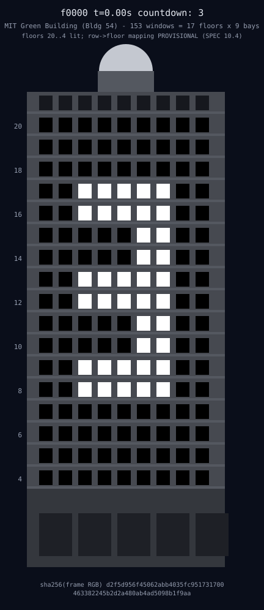 | 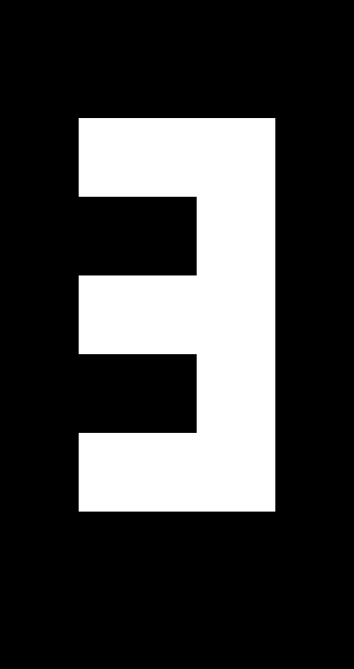 | `d2f5d956f45062abb4035fc951731700463382245b2d2a480ab4ad5098b1f9aa` |
| 30 | 1.00 s | countdown **2** | 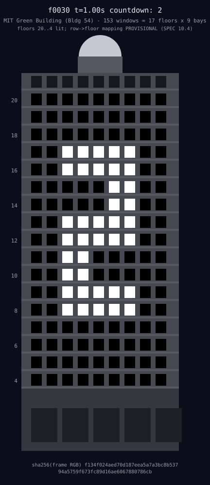 | 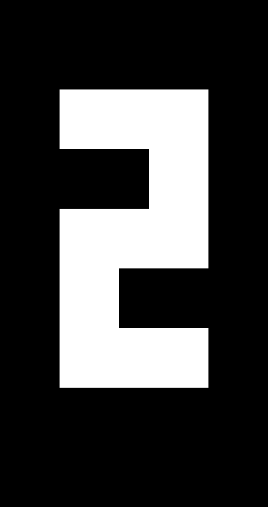 | `f134f024aed70d187eea5a7a3bc8b53794a5759f673fc89d16ae6067880786cb` |
| 60 | 2.00 s | countdown **1** | 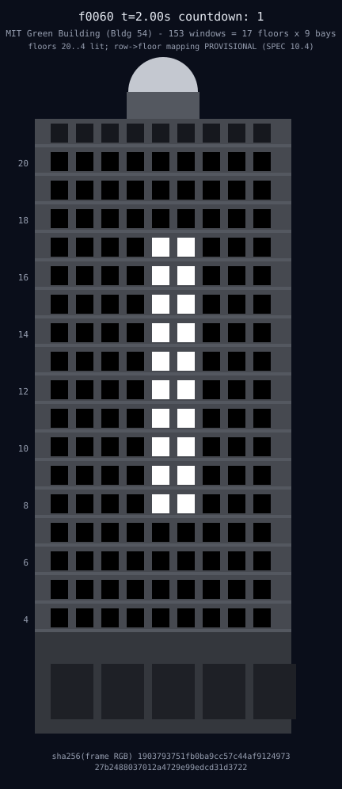 | 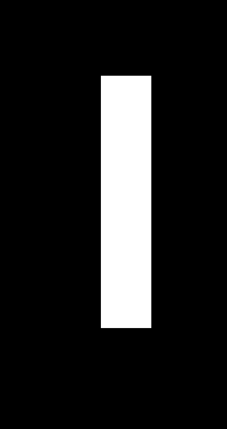 | `1903793751fb0ba9cc57c44af912497327b2488037012a4729e99edcd31d3722` |
| 90 | 3.00 s | boot black frame (§8.4) | 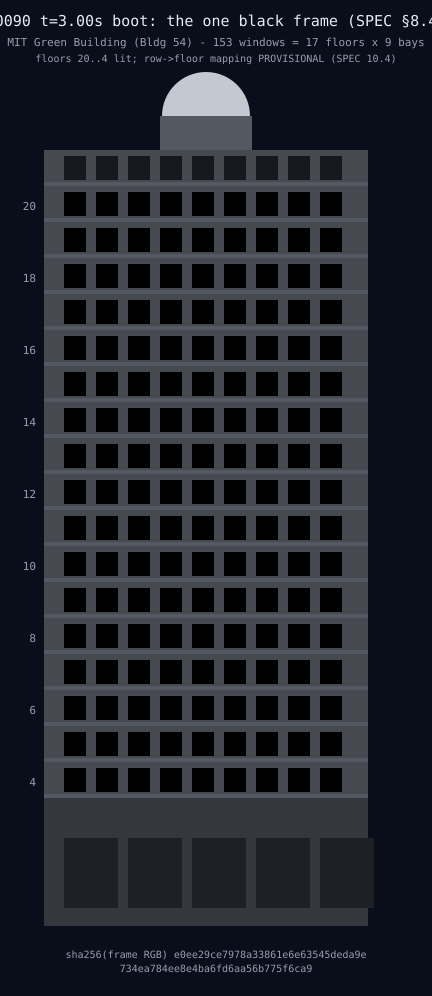 |  | `e0ee29ce7978a33861e6e63545deda9e734ea784ee8e4ba6fd6aa56b775f6ca9`, the all-black known answer of SPEC Appendix A |
| 91 | 3.03 s | first spawn (J, and its ghost) |  | 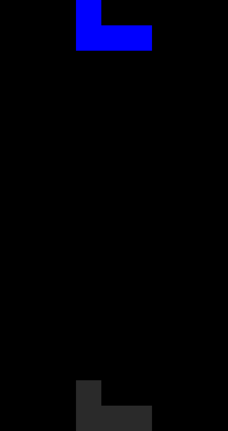 | `1a26ee7e4b911824fd9709a1fd0186104084747b218fc3de1b3ac855eb782207` |
| 158 | 5.27 s | line-clear flash, 1st of 5 frames |  |  | `55ac849e7e0935930049a76941834813849ddd731c78ae4f69e51ac163dfa783` |
| 163 | 5.43 s | the frame after the clear | 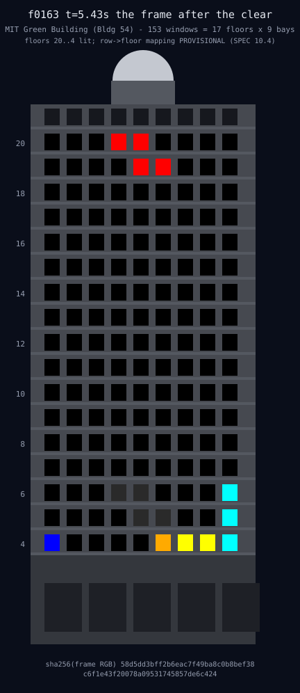 | 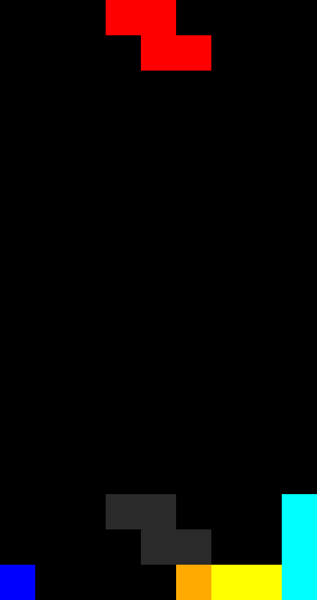 | `58d5dd3bff2b6eac7f49ba8c0b8bef38c6f1e43f20078a09531745857de6c424` |
| 354 | 11.80 s | level up 0 → 1 (5 lines) | 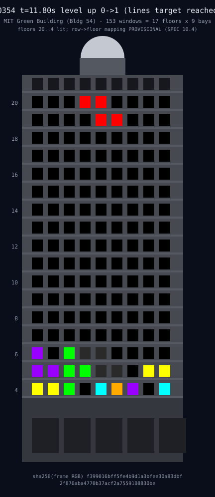 | 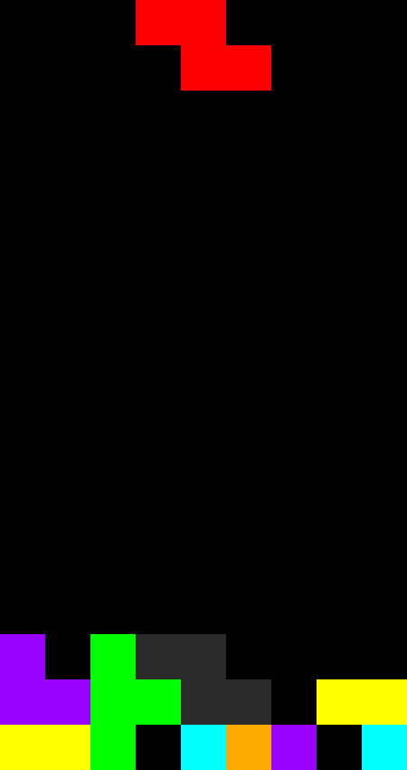 | `f399016bff5fe4b9d1a3bfee30a83dbf2f870aba4770b37acf2a7559108830be` |
| 2700 | 90.00 s | mid-game board | 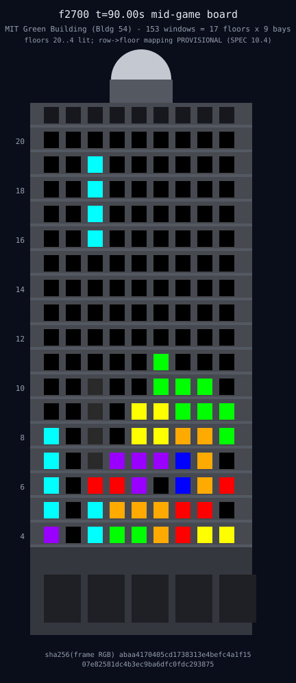 | 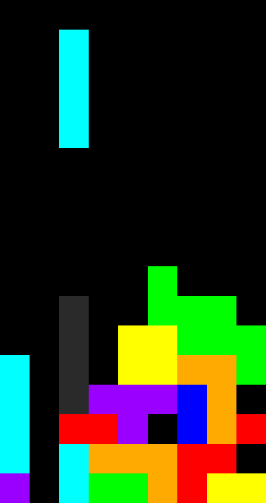 | `abaa4170405cd1738313e4befc4a1f1507e82581dc4b3ec9ba6dfc0fdc293875` |
| 4182 | 139.40 s | last play frame before the top-out | 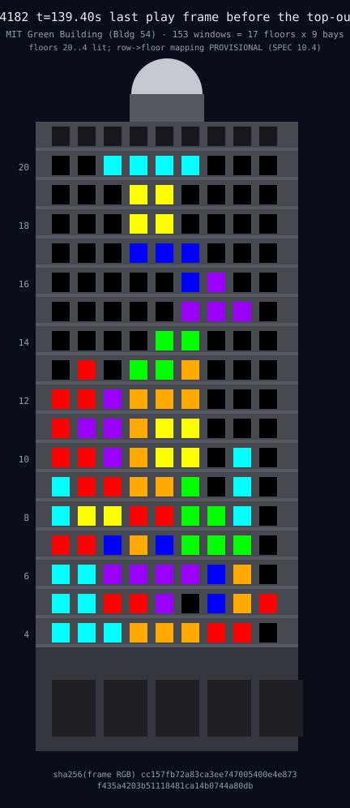 | 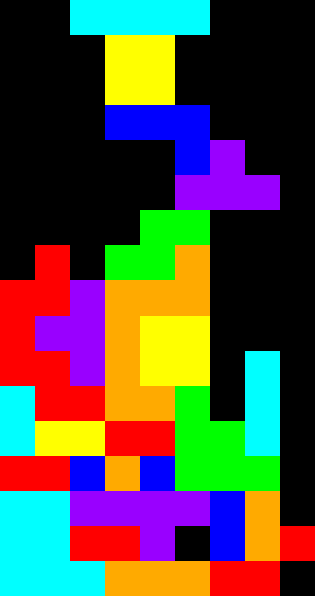 | `cc157fb72a83ca3ee747005400e4e873f435a4203b51118481ca14b0744a80db` |
| 4183 | 139.43 s | game over: fill-up starts (t = 0) | 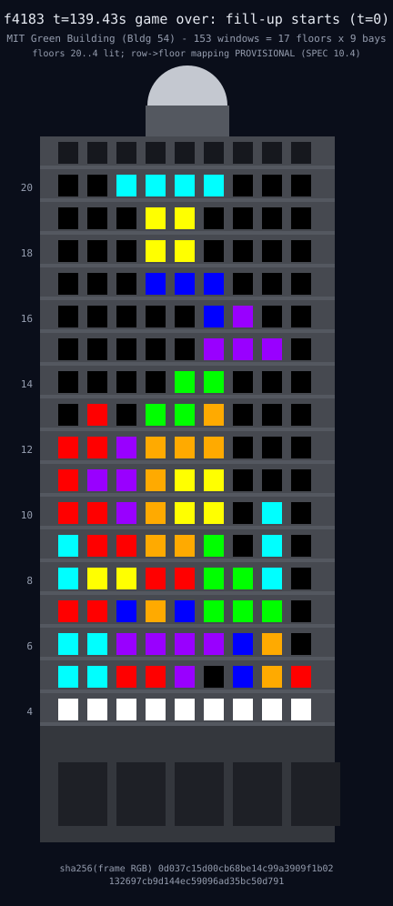 | 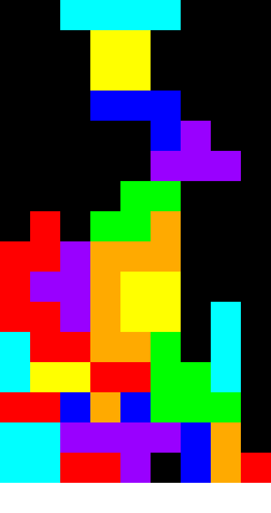 | `0d037c15d00cb68be14c99a3909f1b02132697cb9d144ec59096ad35bc50d791` |
| 4216 | 140.53 s | game over: fill-up ends (t = 33) |  |  | `cc1c8c603a0863247abc4b8a117a234714b37d2be10ca27218301e5e617830d8`, all white (Appendix A) |
| 4217 | 140.57 s | game over: the 150-frame white wait (t = 34) | 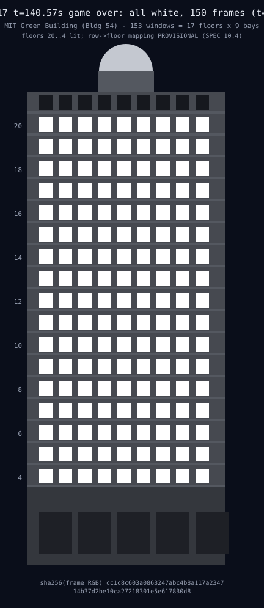 |  | `cc1c8c603a0863247abc4b8a117a234714b37d2be10ca27218301e5e617830d8` |
| 4367 | 145.57 s | fall-down starts, rows darken from the top (t = 184, QUIRK-19) | 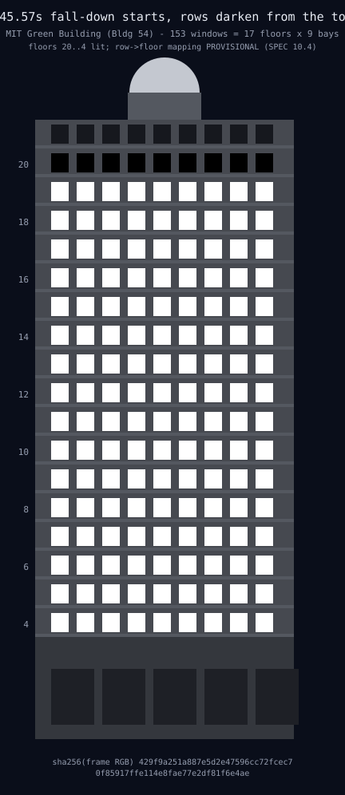 |  | `429f9a251a887e5d2e47596cc72fcec70f85917ffe114e8fae77e2df81f6e4ae` |
| 4400 | 146.67 s | fall-down ends (t = 217); the countdown follows | 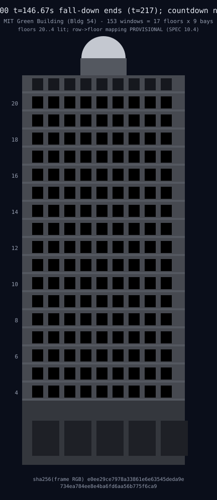 |  | `e0ee29ce7978a33861e6e63545deda9e734ea784ee8e4ba6fd6aa56b775f6ca9` |
| 4491 | 149.70 s | idle board: an empty well and game 2's first piece | 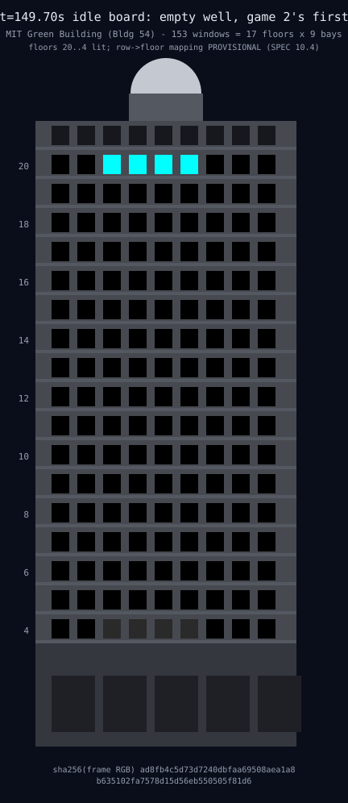 | 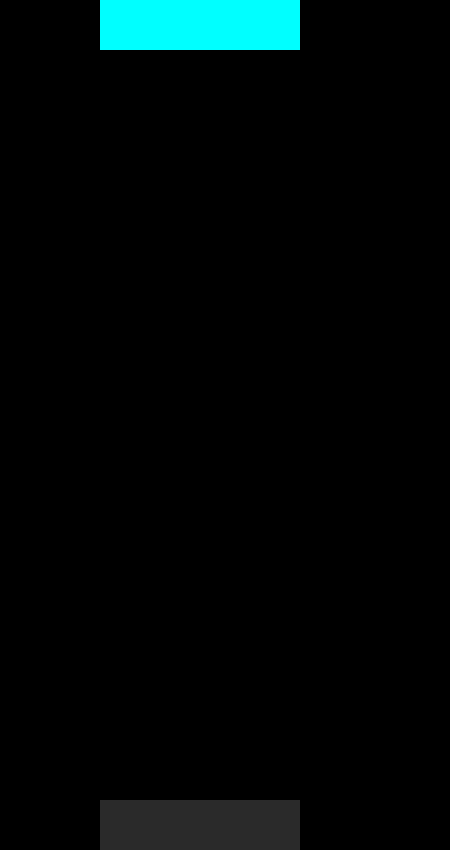 | `ad8fb4c5d73d7240dbfaa69508aea1a8b635102fa7578d15d56eb550505f81d6` |

Every moment also has a `.png` of each view: the grid PNG is 450 × 850, and the facade PNG has no text labels. The PNGs are written with `zlib` from the standard library, because Pillow and cairosvg were not installed. With seed 42 the bot's first game over comes at frame 4183, after 239 pieces, a score of 11 100 and level 10. After the fall-down, the post-game-over countdown (frames 4401–4490) repeats the frame-0…89 glyphs without the boot black frame (QUIRK-10), and play resumes at 4491.

## Casts (asciinema) and GIFs

All five were recorded headless with asciinema 3.2.1 (`-f asciicast-v2`) and converted with agg 1.9.0. On FreeBSD, the GIF tool is the package **`asciinema-agg`**; the `agg` package is Anti-Grain Geometry, which pulls in SDL and X11. Play a cast in a terminal with `asciinema play docs/media/casts/<name>.cast`. **Nothing is uploaded** to asciinema.org or anywhere else.

### KAV-14 replay: a verified 30 s game in plain ASCII

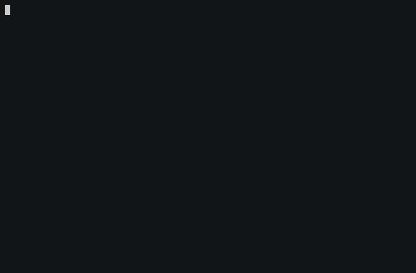

**What it shows.** [`casts/mock-game-30s.cast`](casts/mock-game-30s.cast): 900 frames at 30 FPS (30 s), one character per window. `.` is empty, `#` is white (flash, game over, digits), `+` is the ghost, and `I J L O S Z T` are the pieces. There is no colour: the output is printable ASCII plus cursor positioning only.

**The game.** It is the known-answer vector **KAV-14**, trace [`spec/conformance/traces/14-bot-marathon.json`](../../spec/conformance/traces/14-bot-marathon.json): seed 2026, a bot with 5 % random input, 3200 frames. [`ascii_player.py`](ascii_player.py) replays it from `init(seed)` with the recorded events and shows its **last 900 frames (2300–3199)**. That window covers line clears at level 19, the game over at frame 2520, the fill, wait and fall-down, the countdown, and the next game.

**What the footer checks.** Nothing on screen is taken on trust:
- **226/226 pinned digests.** KAV-14 pins every 4th frame, plus the last. Each pinned frame in the window is re-hashed from the ASCII actually shown (mapped back through the SPEC §4.1 palette) and compared with the digest stored in the trace.
- **The whole trace.** 801/801 digests match, and so does the final observation.
- **The ASCII round trip.** All 900/900 frames re-hash to the engine's digest.

```
KAV-14: 226/226 frame digests match (SPEC Appendix A) -- PASS
  frames 2300-3199 shown; pinned: every 4th frame + the last
  whole trace 801/801 + final observation ok; ASCII->RGB 900/900
```

"KAV-NN" is trace NN in `spec/conformance/traces/`: the conformance traces become the known-answer vectors of SPEC Appendix A in SPEC v2. No trace in the set pins all 900 of its first 900 frames, which is why this replay reports **pinned** digests. The per-frame traces (`digest_every` = 1) are all 791 frames or shorter.

### KAV-01: the SPEC §8.4 countdown


[`casts/countdown.cast`](casts/countdown.cast) shows frames 0–90 of **KAV-01** ([`01-idle-gravity.json`](../../spec/conformance/traces/01-idle-gravity.json), seed 1, no input). Each digit is shown for exactly 30 frames (**3** for frames 0–29, **2** for 30–59 and **1** for 60–89), followed by the single black boot frame 90. The playback runs at 30 FPS. KAV-01 pins **every** frame, so the footer's check is frame by frame:

```
KAV-01: 91/91 frame digests match (SPEC Appendix A) -- PASS
  frames 0-90 shown; every frame pinned
  whole trace 791/791 + final observation ok; ASCII->RGB 91/91
```

The countdown is the same for every seed; the trace just pins it. Keep this path: SPEC §8.4 links to `docs/media/casts/countdown.gif`.

### The ANSI simulator with the demo bot

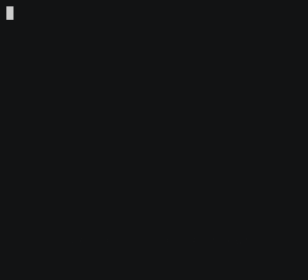

[`casts/sim-seed42-bot.cast`](casts/sim-seed42-bot.cast): `python -m tetris_sim --seed 42 --bot --frames 900 --ansi` in a 44 × 20 terminal, 30 s of truecolor frames, with the JSON observation at the end. It is the same run as the snapshots above (frames 0–899).

### The engine from a real REPL

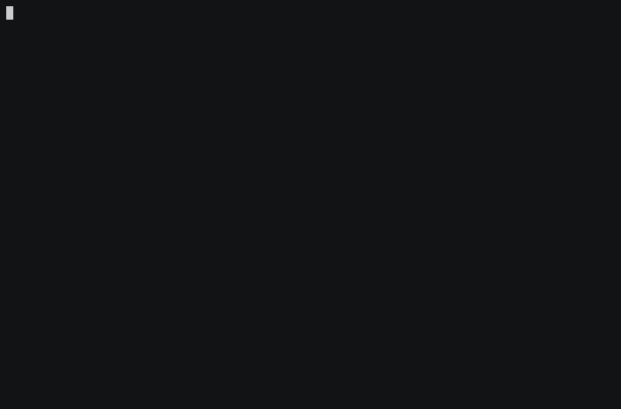

[`casts/repl-engine.cast`](casts/repl-engine.cast) is a real `python -i` session. [`pty_drive.py`](pty_drive.py) starts the REPL in its own pseudo-terminal, waits for each real `>>>` prompt, and types the input one keystroke at a time; the echo and the output come from Python.

1. It builds `new_game(seed=42)` and steps it into the countdown.
2. It prints the "3" as ANSI.
3. It steps to frame 90 and shows that frame's digest, the all-black known answer `e0ee29ce…`.
4. It rotates, shifts and hard-drops the first J, printing each frame and the final digest.

### BSD tetris(6) on a 9 × 17 well


[`casts/bsd-tetris-17x9.cast`](casts/bsd-tetris-17x9.cast) is the classic BSD `tetris(6)` from [`contrib/bsd-tetris-mit/`](../../contrib/bsd-tetris-mit/), built with its well resized to 9 × 17. It runs unattended at `-l 6 -p` in an 80 × 22 pty: nobody presses a key, the pieces stack until one no longer fits, and the driver presses RETURN for the score table. This game uses `arc4random`, so a re-recording will differ. It is *not* the MIT game; see [`../FREEBSD-TETRIS.md`](../FREEBSD-TETRIS.md).

## Regenerate

From the repo root, with any `python3` (3.12) on `PATH` that has no extra packages:

```sh
python3 docs/media/render_snapshots.py              # rewrite docs/media/snapshots/ (16 moments, 65 files)
python3 docs/media/render_snapshots.py --check      # verify digests, SVG bytes and PNG pixels; exit 1 on any finding

python3 docs/media/ascii_player.py game --check       # KAV-14 check only (no playback)
python3 docs/media/ascii_player.py countdown --check  # KAV-01 check only

contrib/bsd-tetris-mit/build.sh                     # needed only for the "bsd" cast
docs/media/record_casts.sh all                      # or: sim | repl | bsd | countdown | mock | gif
```

`record_casts.sh` needs asciinema 3.x and agg (FreeBSD: `pkg install asciinema asciinema-agg`). It runs each recording with `asciinema rec --headless -f asciicast-v2 --window-size …`, and converts with `agg --font-family "DejaVu Sans Mono" --font-size 14 --line-height 1.2` (15 fps cap for the two game casts, 30 for the countdown, 10 for the others). Each GIF stays under 2 MB.

| File | Size | | File | Size |
|---|---:|---|---|---:|
| `sim-seed42-bot.cast` | 3.1 MB | | `sim-seed42-bot.gif` | 360 KB |
| `mock-game-30s.cast` | 290 KB | | `mock-game-30s.gif` | 1.06 MB |
| `repl-engine.cast` | 28 KB | | `repl-engine.gif` | 327 KB |
| `countdown.cast` | 19 KB | | `countdown.gif` | 90 KB |
| `bsd-tetris-17x9.cast` | 9 KB | | `bsd-tetris-17x9.gif` | 37 KB |
| `snapshots/` (65 files) | 534 KB | | **total media** | **≈ 5.6 MB** |

The sim cast is the big one because the ANSI renderer redraws all 153 cells in 24-bit colour on every frame. It is kept whole because it is the literal output of the documented demo command.

**Checked on** FreeBSD 15.1 (amd64), Python 3.12.14, asciinema 3.2.1 and agg 1.9.0, on 2026-09-11, against SPEC v1 and the traces sealed with it.
